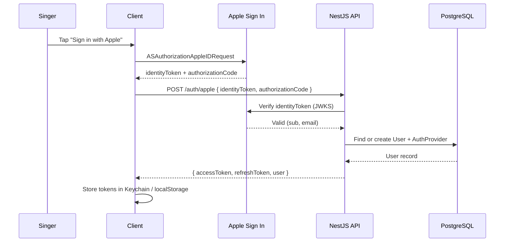
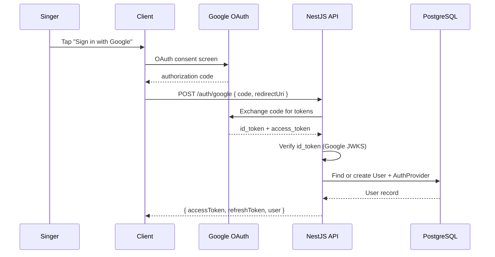
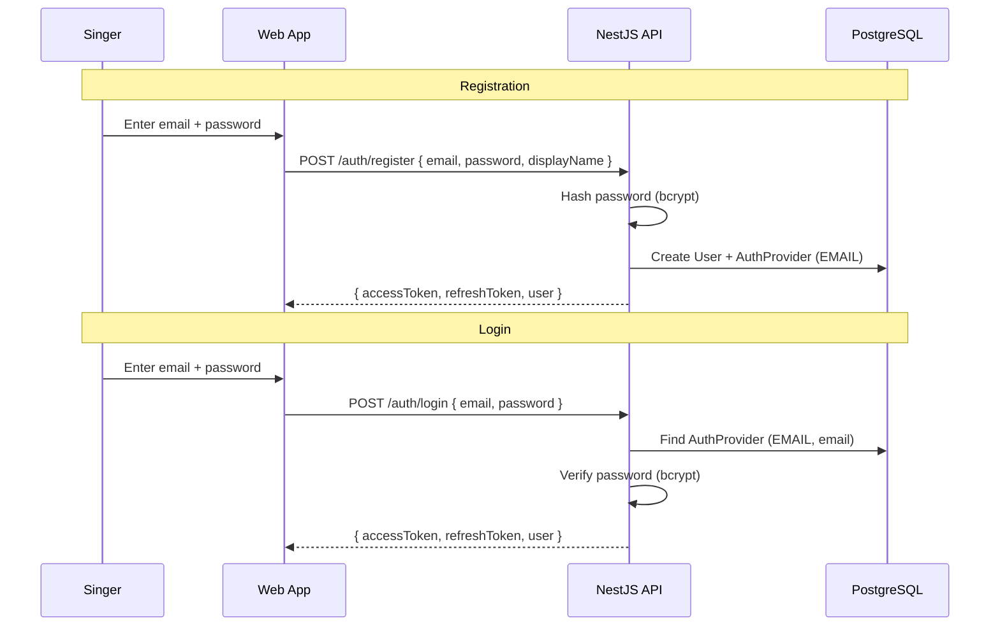
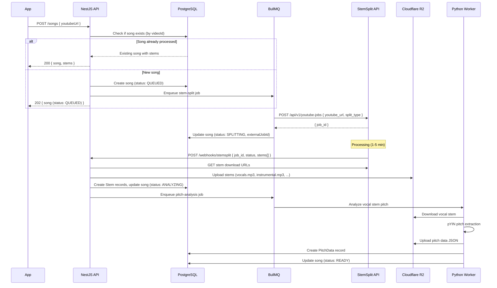
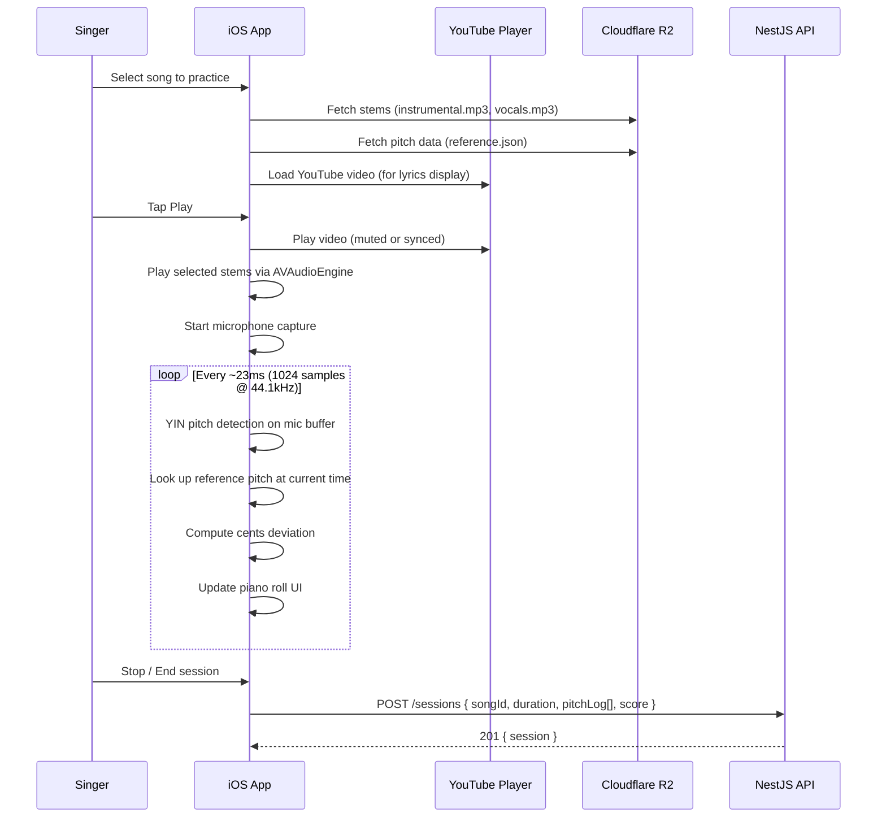

# Intonavio — API Design

## Base URL

```
https://api.intonavio.com/v1
```

All endpoints require `Authorization: Bearer <jwt>` unless noted otherwise.

---

## Authentication Flows

### Apple Sign In (iOS / macOS / Web)



### Google OAuth (Web / iOS)



### Email / Password (Web)



## Song Processing Flow



## Practice Session Flow



---

## Endpoint Reference

### Auth

| Method   | Path             | Description                           | Auth          |
| -------- | ---------------- | ------------------------------------- | ------------- |
| `POST`   | `/auth/apple`    | Exchange Apple identity token for JWT | No            |
| `POST`   | `/auth/google`   | Exchange Google OAuth code for JWT    | No            |
| `POST`   | `/auth/register` | Register with email and password      | No            |
| `POST`   | `/auth/login`    | Login with email and password         | No            |
| `POST`   | `/auth/refresh`  | Refresh access token                  | Refresh token |
| `DELETE` | `/auth/account`  | Delete account and all data           | Yes           |

#### `POST /auth/apple`

**Request:**

```json
{
  "identityToken": "eyJ...",
  "authorizationCode": "c2a...",
  "fullName": { "givenName": "Jane", "familyName": "Doe" }
}
```

**Response (200):**

```json
{
  "accessToken": "eyJ...",
  "refreshToken": "rt_...",
  "user": {
    "id": "usr_abc123",
    "email": "jane@icloud.com",
    "displayName": "Jane D."
  }
}
```

#### `POST /auth/google`

**Request:**

```json
{
  "code": "4/0AX4XfWh...",
  "redirectUri": "https://app.intonavio.com/auth/google/callback"
}
```

**Response (200):** Same shape as Apple auth response.

#### `POST /auth/register`

**Request:**

```json
{
  "email": "jane@example.com",
  "password": "securePassword123",
  "displayName": "Jane D."
}
```

**Response (201):** Same shape as Apple auth response.

#### `POST /auth/login`

**Request:**

```json
{
  "email": "jane@example.com",
  "password": "securePassword123"
}
```

**Response (200):** Same shape as Apple auth response.

---

### Songs

| Method   | Path         | Description                            |
| -------- | ------------ | -------------------------------------- |
| `POST`   | `/songs`     | Submit a YouTube URL for processing    |
| `GET`    | `/songs/:id` | Get song details with stems and status |
| `GET`    | `/songs`     | List user's songs (paginated)          |
| `DELETE` | `/songs/:id` | Remove song from user's library        |

#### `POST /songs`

**Request:**

```json
{
  "youtubeUrl": "https://www.youtube.com/watch?v=dQw4w9WgXcQ"
}
```

**Response (202):**

```json
{
  "id": "song_xyz789",
  "videoId": "dQw4w9WgXcQ",
  "title": "Rick Astley - Never Gonna Give You Up",
  "thumbnailUrl": "https://img.youtube.com/vi/dQw4w9WgXcQ/maxresdefault.jpg",
  "duration": 213,
  "status": "QUEUED",
  "stems": [],
  "createdAt": "2025-06-01T12:00:00Z"
}
```

#### `GET /songs/:id`

**Response (200) — when READY:**

```json
{
  "id": "song_xyz789",
  "videoId": "dQw4w9WgXcQ",
  "title": "Rick Astley - Never Gonna Give You Up",
  "duration": 213,
  "status": "READY",
  "stems": [
    {
      "id": "stem_1",
      "type": "VOCALS",
      "url": "https://r2.intonavio.com/stems/song_xyz789/vocals.mp3",
      "format": "mp3"
    },
    {
      "id": "stem_2",
      "type": "INSTRUMENTAL",
      "url": "https://r2.intonavio.com/stems/song_xyz789/instrumental.mp3",
      "format": "mp3"
    },
    {
      "id": "stem_3",
      "type": "DRUMS",
      "url": "https://r2.intonavio.com/stems/song_xyz789/drums.mp3",
      "format": "mp3"
    },
    {
      "id": "stem_4",
      "type": "BASS",
      "url": "https://r2.intonavio.com/stems/song_xyz789/bass.mp3",
      "format": "mp3"
    },
    {
      "id": "stem_5",
      "type": "OTHER",
      "url": "https://r2.intonavio.com/stems/song_xyz789/other.mp3",
      "format": "mp3"
    }
  ],
  "pitchData": {
    "id": "pitch_1",
    "url": "https://r2.intonavio.com/pitch/song_xyz789/reference.json"
  },
  "createdAt": "2025-06-01T12:00:00Z"
}
```

---

### Stems

| Method | Path                               | Description                |
| ------ | ---------------------------------- | -------------------------- |
| `GET`  | `/songs/:songId/stems`             | List stems for a song      |
| `GET`  | `/songs/:songId/stems/:stemId/url` | Get presigned download URL |

---

### Sessions

| Method | Path            | Description                        |
| ------ | --------------- | ---------------------------------- |
| `POST` | `/sessions`     | Save a practice session            |
| `GET`  | `/sessions`     | List past sessions (paginated)     |
| `GET`  | `/sessions/:id` | Get session details with pitch log |

#### `POST /sessions`

**Request:**

```json
{
  "songId": "song_xyz789",
  "duration": 45,
  "loopStart": 30.5,
  "loopEnd": 55.2,
  "speed": 0.75,
  "overallScore": 72.5,
  "pitchLog": [
    { "time": 30.5, "detectedHz": 440.0, "referenceHz": 440.0, "cents": 0 },
    { "time": 30.55, "detectedHz": 442.1, "referenceHz": 440.0, "cents": 8.3 }
  ]
}
```

**Response (201):**

```json
{
  "id": "sess_abc",
  "songId": "song_xyz789",
  "duration": 45,
  "overallScore": 72.5,
  "createdAt": "2025-06-01T12:30:00Z"
}
```

---

### Webhooks (Internal)

| Method | Path                  | Description                       | Auth           |
| ------ | --------------------- | --------------------------------- | -------------- |
| `POST` | `/webhooks/stemsplit` | StemSplit job completion callback | Webhook secret |

---

## Error Responses

All errors follow a consistent format:

```json
{
  "statusCode": 404,
  "error": "Not Found",
  "message": "Song not found"
}
```

| Status | Usage                                                |
| ------ | ---------------------------------------------------- |
| `400`  | Invalid request body or parameters                   |
| `401`  | Missing or invalid JWT                               |
| `403`  | Accessing another user's resource                    |
| `404`  | Resource not found                                   |
| `409`  | Song already being processed (duplicate YouTube URL) |
| `429`  | Rate limit exceeded                                  |
| `500`  | Internal server error                                |
