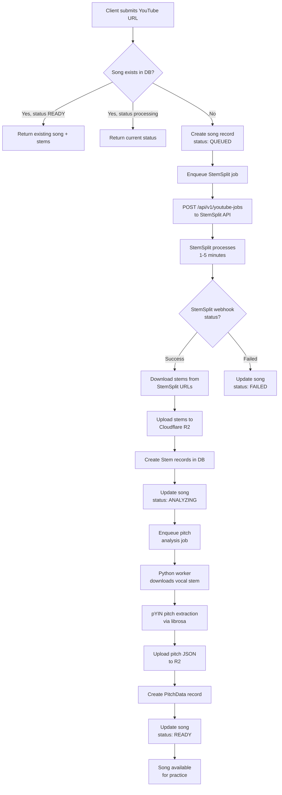
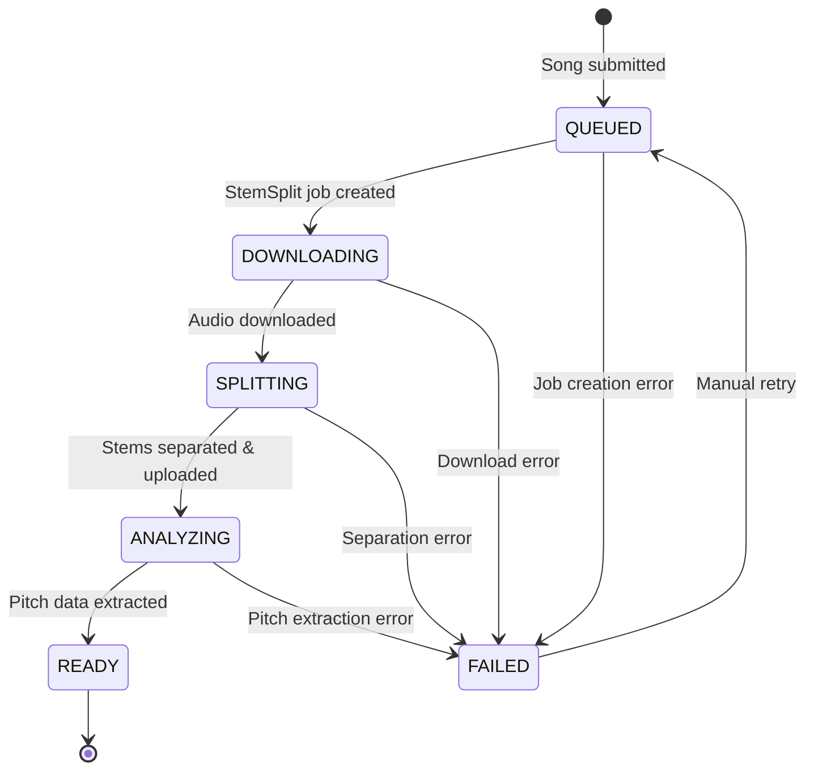
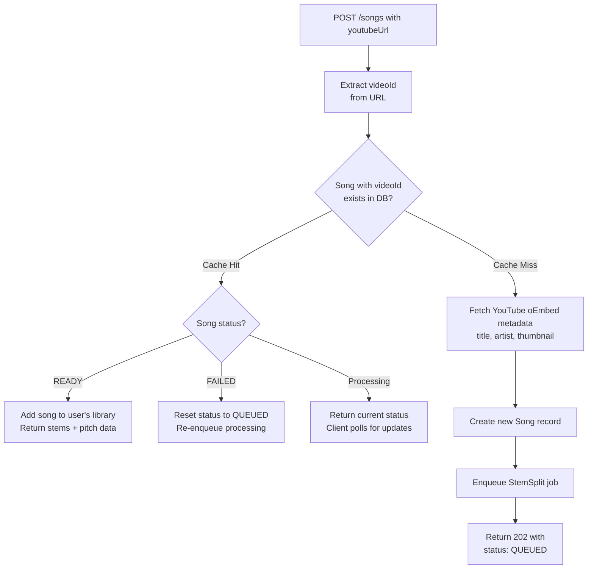
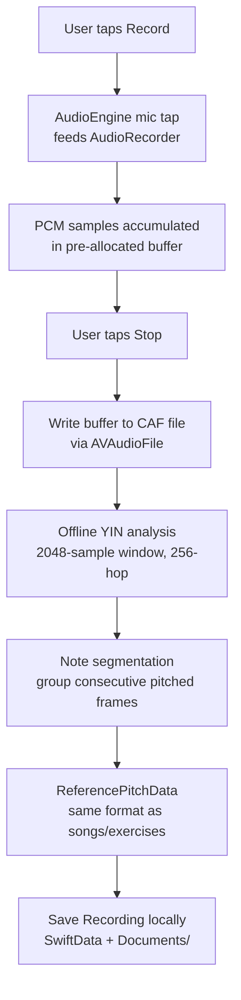

# Intonavio — Audio Processing Pipeline

## Processing Pipeline Overview

End-to-end flow from YouTube URL submission to practice-ready song.



## Job State Machine

States a song goes through during processing.



## Cache Hit vs Cache Miss

Song deduplication avoids redundant processing when multiple users submit the same YouTube video.



---

## StemSplit API Integration

StemSplit offers two flows: **YouTube jobs** (direct URL, 2-stem output) and **file upload jobs** (supports up to 6-stem separation). Intonavio uses the YouTube flow for simplicity.

### Job Creation

```
POST https://stemsplit.io/api/v1/youtube-jobs
Authorization: Bearer <STEMSPLIT_API_KEY>
Content-Type: application/json

{
  "youtubeUrl": "https://www.youtube.com/watch?v=dQw4w9WgXcQ",
  "outputFormat": "MP3",
  "quality": "BEST"
}
```

Note: The YouTube endpoint does **not** accept `outputType` or `webhookUrl`. Webhooks are registered separately via `POST /api/v1/webhooks`. YouTube jobs always produce vocals + instrumental + fullAudio.

### Output Types by Flow

| Flow         | Endpoint        | Available Output Types                      | Stems Produced                                            |
| ------------ | --------------- | ------------------------------------------- | --------------------------------------------------------- |
| YouTube jobs | `/youtube-jobs` | Fixed (vocals + instrumental + fullAudio)   | 3 outputs (2 useful stems)                                |
| File upload  | `/jobs`         | `VOCALS`, `BOTH`, `FOUR_STEMS`, `SIX_STEMS` | Up to 6 stems (vocals, drums, bass, other, piano, guitar) |

### Webhook Registration

Webhooks are registered once via the StemSplit dashboard or API (`POST /api/v1/webhooks`), not per-job. StemSplit sends events for all jobs to the registered URL.

### Webhook Payload

StemSplit uses HMAC-SHA256 signatures for webhook authentication via the `X-Webhook-Signature` header.

```json
{
  "event": "job.completed",
  "timestamp": "2026-01-05T12:30:00Z",
  "data": {
    "jobId": "clxxx123...",
    "status": "COMPLETED",
    "input": {
      "durationSeconds": 240,
      "fileSizeBytes": 4500000
    },
    "outputs": {
      "vocals": {
        "url": "https://stemsplit-storage....r2.cloudflarestorage.com/...",
        "expiresAt": "2026-01-05T13:30:00Z"
      },
      "instrumental": {
        "url": "https://stemsplit-storage....r2.cloudflarestorage.com/...",
        "expiresAt": "2026-01-05T13:30:00Z"
      },
      "fullAudio": {
        "url": "https://stemsplit-storage....r2.cloudflarestorage.com/...",
        "expiresAt": "2026-01-05T13:30:00Z"
      }
    },
    "creditsCharged": 240,
    "createdAt": "2026-01-05T12:00:00Z",
    "completedAt": "2026-01-05T12:02:30Z"
  }
}
```

### Webhook Headers

| Header                | Description                            |
| --------------------- | -------------------------------------- |
| `X-Webhook-Signature` | `sha256=<HMAC-SHA256 of request body>` |
| `X-Webhook-Event`     | Event type (e.g., `job.completed`)     |
| `X-Webhook-Id`        | Webhook endpoint identifier            |

---

## iOS Audio Architecture: Unified AudioEngine

All audio I/O (stem playback + microphone input) runs through a single shared `AudioEngine` instance. This is required for Voice Processing (VPIO/AEC) to work on iOS — the system needs to see both the output going to speakers and the input from the microphone on the same `AVAudioEngine` to cancel speaker bleed from the mic.

### Unified Audio Graph

```
Microphone → inputNode (VP/AEC enabled) ── tap ──→ PitchDetector ring buffer

PlayerNode(vocals)  ──┐
PlayerNode(other)   ──┼→ stemMixer → timePitch → mainMixerNode → output
PlayerNode(full)    ──┘
```

### AudioEngine Lifecycle

1. **`prepare()`** — Configure audio session (`.playAndRecord`, `.measurement`) and enable voice processing on `inputNode`. Must be called before attaching nodes — VP re-creates the audio graph.
2. **Attach nodes** — `StemPlayer.setup()` attaches player nodes, mixer, and timePitch to the prepared engine.
3. **`start()`** — Start the engine with all nodes connected. Observes interruption and route change notifications on iOS. Idempotent — safe to call from multiple consumers.

`StemPlayer`, `PitchDetector`, and `MetronomeTick` all accept a shared `AudioEngine` via init. None creates its own `AVAudioEngine`. The engine starts lazily when stems are set up or pitch detection begins.

### Why One Engine?

Previous architecture used separate engines for `StemPlayer` (output) and `PitchDetector` (input). On iOS, enabling `setVoiceProcessingEnabled(true)` on one engine's input node caused VPIO render errors because both engines competed for audio I/O hardware. With a single engine, VPIO sees the stem output and cancels it from the mic input.

### Audio Route Change Handling

When the audio output route changes (e.g. AirPods connected/disconnected), iOS posts `AVAudioSession.routeChangeNotification`. `AudioEngine` observes this and:

1. Ensures the engine is still running (route changes can stop it)
2. Fires an `onRouteChange` callback so consumers can re-sync playback

`PracticeViewModel` handles the callback by stopping all stems, re-applying the current audio mode volumes, and restarting playback from the current YouTube time. Without this, player nodes lose sync during route changes and all stems become audible at slightly different offsets.

### TimePitch Latency Compensation

`AVAudioUnitTimePitch` introduces processing latency (~125ms) — audio frames take time to pass through the pitch-preserving time-stretch pipeline. `StemPlayer.play(from:)` compensates by scheduling stems ahead by `timePitch.latency`:

```swift
let compensated = time + timePitch.latency
```

This ensures the audio output aligns with the requested playback time after the pipeline delay. The drift checker in `VideoAudioSync` accounts for the same latency when comparing stem position against YouTube time.

### Video-Audio Drift Correction

`VideoAudioSync` polls YouTube time every 2 seconds and compares it with the stem player's current position (adjusted for TimePitch latency). If drift exceeds 150ms, stems are seeked to match YouTube. YouTube is the master clock — stems follow.

### Audio Session Configuration

The audio session uses `.measurement` mode with voice processing enabled on the input node for AEC. All audio routes through stem playback — YouTube audio is not used.

```swift
AVAudioSession.sharedInstance().setCategory(
    .playAndRecord,
    mode: .measurement,  // VP enabled separately on inputNode for AEC
    options: [.defaultToSpeaker, .allowBluetooth, .mixWithOthers]
)
```

Additional pre-detection filtering:

- **RMS noise gate**: `vDSP_rmsqv` (Accelerate) — skip YIN if RMS < 0.01 (~-40 dB)
- **Confidence threshold**: 0.85 (above default 0.80)
- **MIDI jump filter**: Reject >12 semitone jumps within 50ms

---

## Pitch Analysis (Python Worker)

The Python worker extracts reference pitch data from the vocal stem using librosa's pYIN algorithm.

### Pipeline

1. **Download** vocal stem from R2 (`stems/{songId}/VOCALS.mp3`)
2. **Load** audio with librosa at 44.1kHz mono
3. **Extract pitch** using `librosa.pyin()`:
   - **Bandpass pre-filter** (scipy `butter` order 4, `sosfiltfilt`) restricts the signal to 65–1100 Hz before pYIN sees it — everything above C6 in a vocal stem is instrument bleed or harmonics
   - `fmin=65` (C2) — lowest expected singing pitch
   - `fmax=1100` (just above C6 = 1047 Hz) — highest expected singing pitch; caps any residual above-range detection
   - `hop_length=512` — ~11.6ms resolution
4. **Compute RMS** energy per frame using `librosa.feature.rms()` (same hop length)
5. **Octave-error correction** — `fix_octave_errors()` post-processes the frame list with a sliding-window median filter (see below)
6. **Convert** frequencies to MIDI note numbers
7. **Build** JSON frame array with `t`, `hz`, `midi`, `voiced`, `rms` fields
8. **Upload** JSON to R2 at `pitch/{songId}/reference.json`
9. **Update** database: create PitchData record, set song status to READY

### Key Parameters

| Parameter   | Value                                                                    | Rationale                                                                                                              |
| ----------- | ------------------------------------------------------------------------ | ---------------------------------------------------------------------------------------------------------------------- |
| Sample rate | 44,100 Hz                                                                | Standard audio quality                                                                                                 |
| Hop length  | 512 samples                                                              | ~11.6ms — matches real-time detection resolution                                                                       |
| fmin        | 65 Hz (C2)                                                               | Covers bass vocal range                                                                                                |
| fmax        | 1,100 Hz (C6)                                                            | Highest soprano C6 ≈ 1047 Hz — anything above in a vocal stem is instrument bleed/harmonics, never a real note         |
| Pre-filter  | Butterworth bandpass 65–1100 Hz (scipy `butter` order 4 + `sosfiltfilt`) | Mathematically prevents the Sound of Silence 3:04 class of errors where pYIN tracked 1500–2000 Hz instrument harmonics |
| Algorithm   | pYIN                                                                     | More robust than YIN for pre-recorded audio; handles vibrato                                                           |

### Octave-Error Correction

pYIN's internal HMM penalizes large frame-to-frame jumps symmetrically — it does **not** specifically penalize octave jumps. As a result it sometimes locks onto the 2nd harmonic (octave up) or sub-harmonic (octave down) for sustained stretches when local autocorrelation is stronger there. Real-world examples encountered:

- **Adele "Hello"** at 1:08–1:13 — 164 frames reported ~932 Hz (Bb5) instead of the actual ~466 Hz (Bb4). One full octave high.
- **Disturbed "Sound of Silence"** at 2:45 — 56 frames reported ~147 Hz (D3) instead of ~294 Hz (D4). One octave low.

`analyzer.fix_octave_errors(frames, window_size=51, semitone_threshold=10.0)` runs after `build_frames` and before `compute_stats`:

1. For each voiced frame, build a sliding window of ±25 surrounding frames (~0.6s).
2. Compute the **median MIDI** of voiced frames in that window.
3. If the current frame deviates by more than `semitone_threshold` (10 semitones) above the median → halve `hz` (subtract 12 semitones).
4. If it deviates by more than `semitone_threshold` below → double `hz`.
5. Frames with fewer than 5 voiced neighbors in the window are skipped (insufficient context).

Limitations: the median-based approach **cannot fix errors in sections where surrounding pitch is highly variable** (e.g. dense climaxes with rapid melodic movement and instrument bleed) — the median itself becomes unreliable. Bogus high-frequency detections from instrument bleed (1500–2000 Hz at 3:04 in Sound of Silence) also evade this fix because they're not strict octave multiples of the surrounding melody. See `docs/yin-comparison-results.md` and the **Future Improvements** section below.

### Retroactive Fix Script

`workers/pitch-analyzer/scripts/fix_octave_errors_r2.py` re-runs the same correction over all existing `pitch/*/reference.json` files in R2, in-place. Used to retroactively clean up songs analyzed before `fix_octave_errors` was added to the pipeline. Idempotent — running it twice produces the same output.

```bash
docker exec -w /app intonavio-worker-1 python scripts/fix_octave_errors_r2.py
```

### Future Improvements (Pitch Quality Roadmap)

The current pYIN + octave-correction stack has known failure modes in dense orchestral sections. The following stack of complementary improvements has been researched (April 2026, see `docs/yin-comparison-results.md`) and is the planned upgrade path:

| #   | Change                                                                                                                                                                                                  | Effort               | What it fixes                                                                                                                                                                                   |
| --- | ------------------------------------------------------------------------------------------------------------------------------------------------------------------------------------------------------- | -------------------- | ----------------------------------------------------------------------------------------------------------------------------------------------------------------------------------------------- |
| 1   | ✅ **DONE (2026-04-07)** — Lower `fmax` from 2093 → **1100 Hz** + bandpass pre-filter to vocal range                                                                                                    | 1 hr                 | Spurious 1500–2000 Hz instrument-harmonic detections (highest soprano C6 = 1047 Hz, so anything above is always artifact)                                                                       |
| 2   | Raise pYIN `voiced_prob` threshold to **0.8**                                                                                                                                                           | 15 min               | Reduces low-confidence false positives                                                                                                                                                          |
| 3   | Replace pYIN with **PESTO** (`pesto-pitch` 2.0.1, ISMIR 2023, LGPLv3 — run as subprocess) as primary F0 estimator                                                                                       | 0.5 day              | Near-zero octave errors on monophonic vocals; per-frame confidence score                                                                                                                        |
| 4   | Add **RMVPE** (designed for polyphonic input) on the **original mix** as a second opinion; reconcile via confidence-weighted median; mark frames as unvoiced when PESTO and RMVPE disagree by ≥1 octave | 1 day                | Catches residual errors via uncorrelated failure modes; refuses to guess in ambiguous sections                                                                                                  |
| 5   | Upgrade stem separation upstream from current StemSplit to **BS-Roformer Viperx 1297** (~12.97 SDR vs htdemucs_ft ~9.5) via the `audio-separator` Python package (MIT)                                  | 2–3 days + GPU infra | Cleaner vocal stems → fewer bleed errors at the source. Highest ceiling for the "Sound of Silence climax" class of problems but requires a new worker, GPU hosting, and re-processing all songs |

Steps 1–5 are **complementary, not alternatives** — each attacks a different failure mode. Recommended rollout: cheapest first, measure marginal benefit on a regression set after each, only commit to step 5 if 1–4 leave dense orchestral sections still unusable. Use **R-FFE** (Prompt-Singer, arxiv:2403.11780) as the eval metric so octave errors are visible separately from pitch-class errors.

### RMS Energy (Artifact Filtering)

Per-frame RMS energy is computed alongside pitch extraction using `librosa.feature.rms(y=audio, hop_length=512)`. This value is included in the output JSON (`rms` field) and used by iOS/Web clients to filter low-energy artifacts from imperfect stem separation. Frames where `rms < 0.02` are treated as inaudible — excluded from piano roll rendering and MIDI range computation. Without this filtering, pYIN marks residual noise as "voiced" (it has detectable pitch), producing visible artifacts on the piano roll.

---

## Instrument Recording Pipeline

User-recorded instrument audio (guitar, piano, any pitched source) follows a local-only pipeline — no server processing needed.

### Recording Flow



### Audio Recording Architecture

`AudioRecorder` is a new component that captures mic input alongside the existing `PitchDetector`. Both consume the same tap on the shared `AudioEngine`.

```
Microphone --> inputNode (VP) --> tap --> AudioRecorder (accumulates PCM to buffer)
                                     --> PitchDetector (optional real-time display)
```

Key constraints:

- **No allocation on audio thread** — `AudioRecorder` uses a pre-allocated buffer (30s at 44.1kHz = ~2.6MB).
- **No file I/O on audio thread** — the buffer is written to disk after recording stops.
- **Coexists with PitchDetector** — both can run simultaneously from the same tap.

### Offline Pitch Analysis

After recording, `RecordingAnalyzer` runs YIN over the saved buffer:

1. Slide a 2048-sample window with 256-sample hops (same as real-time detection).
2. Apply RMS noise gate (`rms < 0.005` = skip) and confidence threshold (0.85).
3. Build `[ReferencePitchFrame]` array — identical format to song/exercise pitch data.
4. Segment into discrete `DetectedNote` objects by grouping consecutive frames at the same MIDI note.

Processing time: <1 second for a 30-second recording on modern iOS hardware.

### Why Client-Side Analysis

| Factor          | Server-side (pYIN)                           | Client-side (YIN)                      |
| --------------- | -------------------------------------------- | -------------------------------------- |
| Latency         | Network round-trip + queue + processing      | <1 second on-device                    |
| Offline support | No                                           | Yes                                    |
| Cost            | R2 storage + worker CPU                      | Zero                                   |
| Accuracy        | Better for noisy/reverberant audio           | Sufficient for close-mic'd instruments |
| Complexity      | New API endpoint + job type + worker changes | Self-contained on iOS                  |

For clean, close-microphone instrument recordings, YIN's accuracy is comparable to pYIN. The server path adds complexity without meaningful quality improvement.

### Reuse of Practice Infrastructure

Once `ReferencePitchData` is produced from the recording, all existing components work without modification:

- `ReferencePitchStore.load(from:)` — loads the pitch frames for O(1) time-based lookup
- `ScoringEngine.evaluate()` — compares detected voice against recording reference
- `PianoRollRenderer` — renders reference zones/lines from recording pitch data
- `GuideTone` — can play back detected notes via SoundFont as an audio guide

See `docs/17-instrument-recording.md` for the full feature spec.

---

## Cost Optimization

| Strategy               | Description                                                                      |
| ---------------------- | -------------------------------------------------------------------------------- |
| **Song deduplication** | Same videoId shared across users — process once, serve many                      |
| **R2 storage**         | No egress fees for stem downloads (Cloudflare R2)                                |
| **Lazy processing**    | Only process songs when first requested, not speculatively                       |
| **Format choice**      | MP3 for stems (smaller files, acceptable quality for practice)                   |
| **TTL on failed jobs** | Auto-retry failed jobs up to 3 times, then mark as FAILED                        |
| **StemSplit pricing**  | Credits = audio duration in seconds. ~$0.10/min — a 4-min song costs ~$0.40 once |
