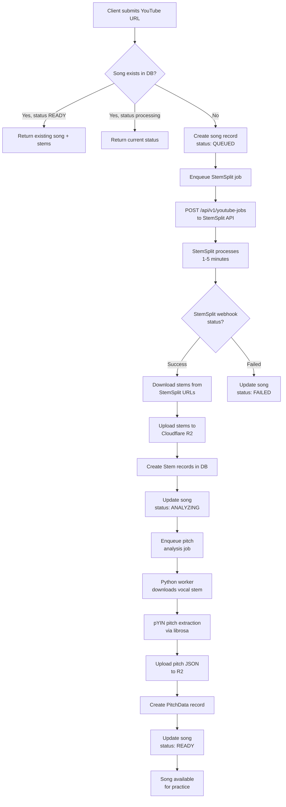
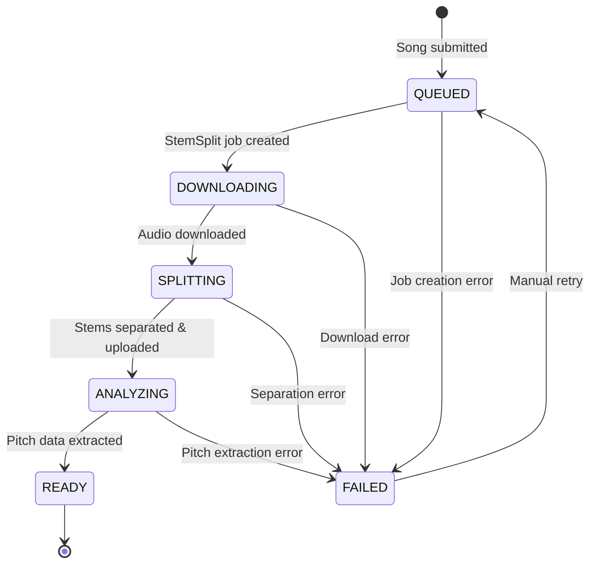
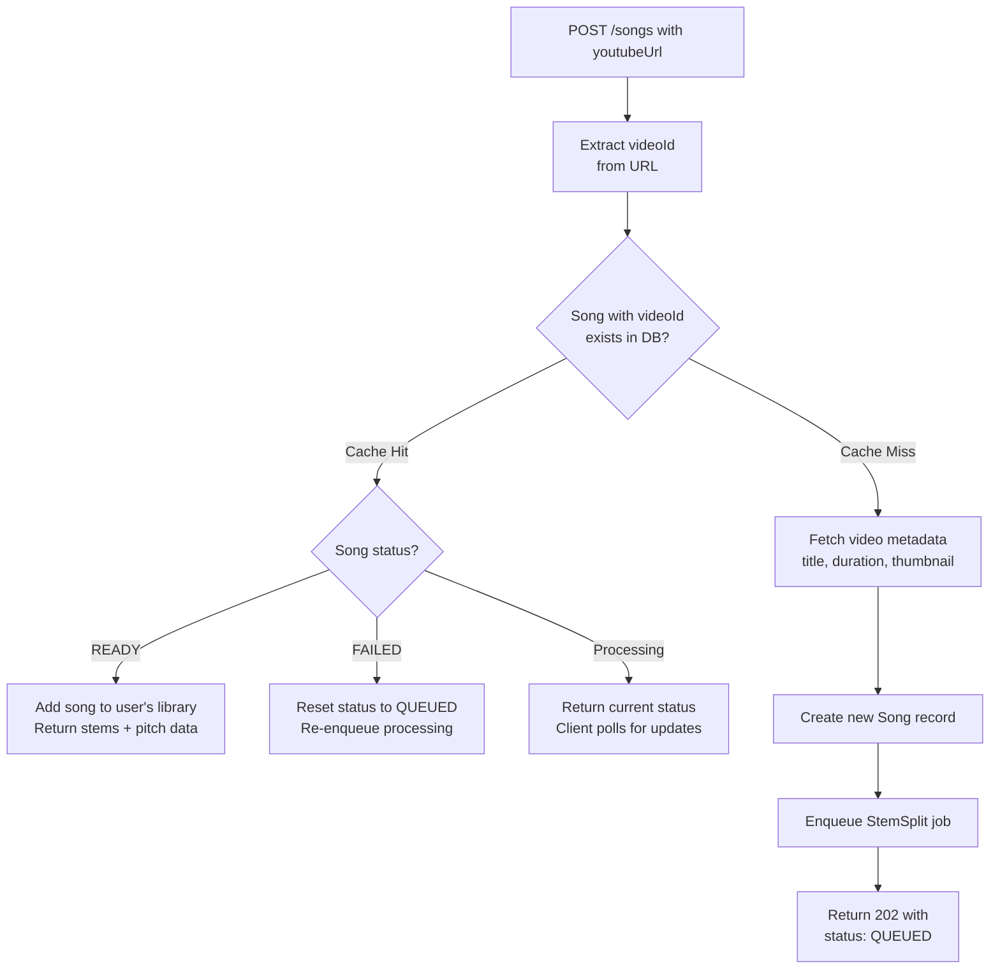

# Intonavio — Audio Processing Pipeline

## Processing Pipeline Overview

End-to-end flow from YouTube URL submission to practice-ready song.



## Job State Machine

States a song goes through during processing.



## Cache Hit vs Cache Miss

Song deduplication avoids redundant processing when multiple users submit the same YouTube video.



---

## StemSplit API Integration

StemSplit offers two flows: **YouTube jobs** (direct URL, 2-stem output) and **file upload jobs** (supports up to 6-stem separation). Intonavio uses the YouTube flow for simplicity.

### Job Creation

```
POST https://stemsplit.io/api/v1/youtube-jobs
Authorization: Bearer <STEMSPLIT_API_KEY>
Content-Type: application/json

{
  "youtubeUrl": "https://www.youtube.com/watch?v=dQw4w9WgXcQ",
  "outputFormat": "MP3",
  "quality": "BEST"
}
```

Note: The YouTube endpoint does **not** accept `outputType` or `webhookUrl`. Webhooks are registered separately via `POST /api/v1/webhooks`. YouTube jobs always produce vocals + instrumental + fullAudio.

### Output Types by Flow

| Flow         | Endpoint        | Available Output Types                      | Stems Produced                                            |
| ------------ | --------------- | ------------------------------------------- | --------------------------------------------------------- |
| YouTube jobs | `/youtube-jobs` | Fixed (vocals + instrumental + fullAudio)   | 3 outputs (2 useful stems)                                |
| File upload  | `/jobs`         | `VOCALS`, `BOTH`, `FOUR_STEMS`, `SIX_STEMS` | Up to 6 stems (vocals, drums, bass, other, piano, guitar) |

### Webhook Registration

Webhooks are registered once via the StemSplit dashboard or API (`POST /api/v1/webhooks`), not per-job. StemSplit sends events for all jobs to the registered URL.

### Webhook Payload

StemSplit uses HMAC-SHA256 signatures for webhook authentication via the `X-Webhook-Signature` header.

```json
{
  "event": "job.completed",
  "timestamp": "2026-01-05T12:30:00Z",
  "data": {
    "jobId": "clxxx123...",
    "status": "COMPLETED",
    "input": {
      "durationSeconds": 240,
      "fileSizeBytes": 4500000
    },
    "outputs": {
      "vocals": {
        "url": "https://stemsplit-storage....r2.cloudflarestorage.com/...",
        "expiresAt": "2026-01-05T13:30:00Z"
      },
      "instrumental": {
        "url": "https://stemsplit-storage....r2.cloudflarestorage.com/...",
        "expiresAt": "2026-01-05T13:30:00Z"
      }
    },
    "creditsCharged": 240,
    "createdAt": "2026-01-05T12:00:00Z",
    "completedAt": "2026-01-05T12:02:30Z"
  }
}
```

### Webhook Headers

| Header                | Description                            |
| --------------------- | -------------------------------------- |
| `X-Webhook-Signature` | `sha256=<HMAC-SHA256 of request body>` |
| `X-Webhook-Event`     | Event type (e.g., `job.completed`)     |
| `X-Webhook-Id`        | Webhook endpoint identifier            |

---

## Pitch Analysis (Python Worker)

The Python worker extracts reference pitch data from the vocal stem using librosa's pYIN algorithm.

### Pipeline

1. **Download** vocal stem from R2 (`stems/{songId}/VOCALS.mp3`)
2. **Load** audio with librosa at 44.1kHz mono
3. **Extract pitch** using `librosa.pyin()`:
   - `fmin=65` (C2) — lowest expected singing pitch
   - `fmax=2093` (C7) — highest expected singing pitch
   - `hop_length=512` — ~11.6ms resolution
4. **Convert** frequencies to MIDI note numbers
5. **Build** JSON frame array with `t`, `hz`, `midi`, `voiced` fields
6. **Upload** JSON to R2 at `pitch/{songId}/reference.json`
7. **Update** database: create PitchData record, set song status to READY

### Key Parameters

| Parameter   | Value         | Rationale                                                    |
| ----------- | ------------- | ------------------------------------------------------------ |
| Sample rate | 44,100 Hz     | Standard audio quality                                       |
| Hop length  | 512 samples   | ~11.6ms — matches real-time detection resolution             |
| fmin        | 65 Hz (C2)    | Covers bass vocal range                                      |
| fmax        | 2,093 Hz (C7) | Covers soprano vocal range                                   |
| Algorithm   | pYIN          | More robust than YIN for pre-recorded audio; handles vibrato |

---

## Cost Optimization

| Strategy               | Description                                                                      |
| ---------------------- | -------------------------------------------------------------------------------- |
| **Song deduplication** | Same videoId shared across users — process once, serve many                      |
| **R2 storage**         | No egress fees for stem downloads (Cloudflare R2)                                |
| **Lazy processing**    | Only process songs when first requested, not speculatively                       |
| **Format choice**      | MP3 for stems (smaller files, acceptable quality for practice)                   |
| **TTL on failed jobs** | Auto-retry failed jobs up to 3 times, then mark as FAILED                        |
| **StemSplit pricing**  | Credits = audio duration in seconds. ~$0.10/min — a 4-min song costs ~$0.40 once |
