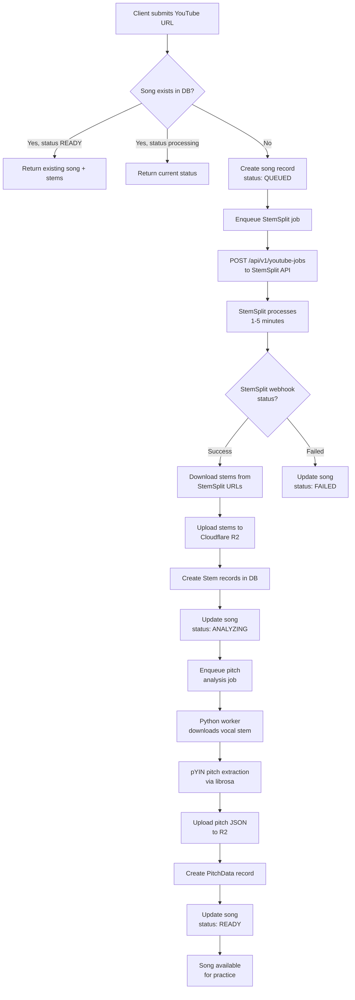
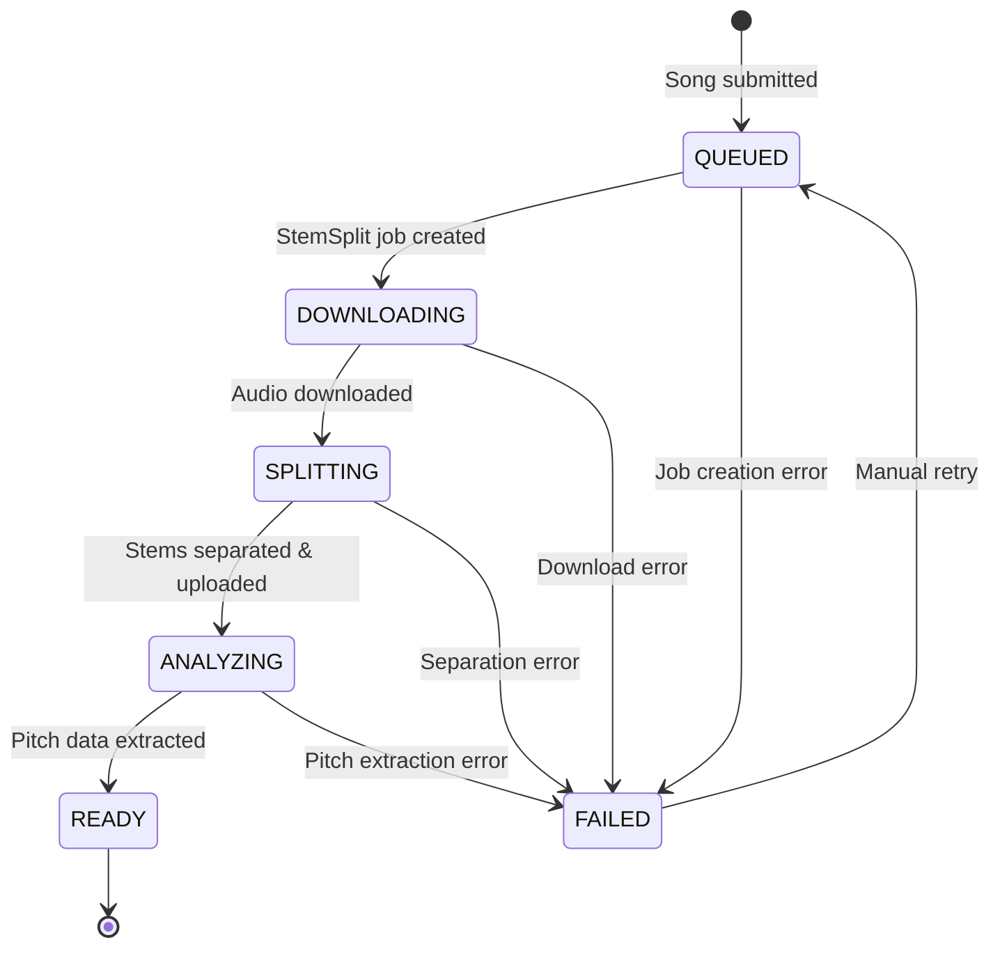
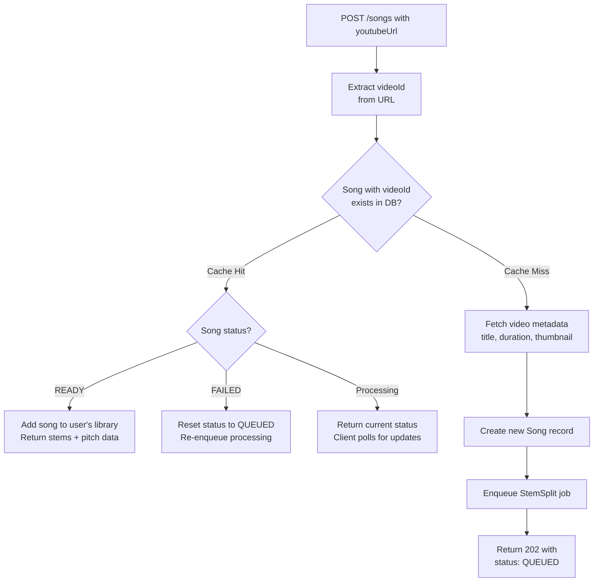

# Intonavio — Audio Processing Pipeline

## Processing Pipeline Overview

End-to-end flow from YouTube URL submission to practice-ready song.



## Job State Machine

States a song goes through during processing.



## Cache Hit vs Cache Miss

Song deduplication avoids redundant processing when multiple users submit the same YouTube video.



---

## StemSplit API Integration

### Job Creation

```
POST https://stemsplit.io/api/v1/youtube-jobs
Authorization: Bearer <STEMSPLIT_API_KEY>
Content-Type: application/json

{
  "youtubeUrl": "https://www.youtube.com/watch?v=dQw4w9WgXcQ",
  "outputType": "SIX_STEMS",
  "outputFormat": "MP3",
  "quality": "BEST",
  "webhookUrl": "https://api.intonavio.com/v1/webhooks/stemsplit"
}
```

### Output Types

| Type         | Stems Produced                            | Use Case                  |
| ------------ | ----------------------------------------- | ------------------------- |
| `VOCALS`     | vocals only                               | Vocal isolation           |
| `BOTH`       | vocals, instrumental                      | Basic vocal/backing split |
| `FOUR_STEMS` | vocals, drums, bass, other                | Standard separation       |
| `SIX_STEMS`  | vocals, drums, bass, other, piano, guitar | Full separation (default) |

### Webhook Payload

```json
{
  "job_id": "ss_job_123",
  "status": "completed",
  "stems": [
    { "type": "vocals", "download_url": "https://cdn.stemsplit.io/..." },
    { "type": "drums", "download_url": "https://cdn.stemsplit.io/..." },
    { "type": "bass", "download_url": "https://cdn.stemsplit.io/..." },
    { "type": "other", "download_url": "https://cdn.stemsplit.io/..." },
    { "type": "piano", "download_url": "https://cdn.stemsplit.io/..." },
    { "type": "guitar", "download_url": "https://cdn.stemsplit.io/..." }
  ]
}
```

---

## Pitch Analysis (Python Worker)

The Python worker extracts reference pitch data from the vocal stem using librosa's pYIN algorithm.

### Pipeline

1. **Download** vocal stem from R2 (`stems/{songId}/vocals.mp3`)
2. **Load** audio with librosa at 44.1kHz mono
3. **Extract pitch** using `librosa.pyin()`:
   - `fmin=65` (C2) — lowest expected singing pitch
   - `fmax=2093` (C7) — highest expected singing pitch
   - `hop_length=512` — ~11.6ms resolution
4. **Convert** frequencies to MIDI note numbers
5. **Build** JSON frame array with `t`, `hz`, `midi`, `voiced` fields
6. **Upload** JSON to R2 at `pitch/{songId}/reference.json`
7. **Update** database: create PitchData record, set song status to READY

### Key Parameters

| Parameter   | Value         | Rationale                                                    |
| ----------- | ------------- | ------------------------------------------------------------ |
| Sample rate | 44,100 Hz     | Standard audio quality                                       |
| Hop length  | 512 samples   | ~11.6ms — matches real-time detection resolution             |
| fmin        | 65 Hz (C2)    | Covers bass vocal range                                      |
| fmax        | 2,093 Hz (C7) | Covers soprano vocal range                                   |
| Algorithm   | pYIN          | More robust than YIN for pre-recorded audio; handles vibrato |

---

## Cost Optimization

| Strategy               | Description                                                    |
| ---------------------- | -------------------------------------------------------------- |
| **Song deduplication** | Same videoId shared across users — process once, serve many    |
| **R2 storage**         | No egress fees for stem downloads (Cloudflare R2)              |
| **Lazy processing**    | Only process songs when first requested, not speculatively     |
| **Format choice**      | MP3 for stems (smaller files, acceptable quality for practice) |
| **TTL on failed jobs** | Auto-retry failed jobs up to 3 times, then mark as FAILED      |
| **StemSplit pricing**  | ~$0.10/min of audio — a 4-min song costs ~$0.40 once           |
