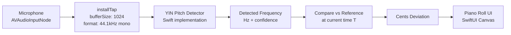
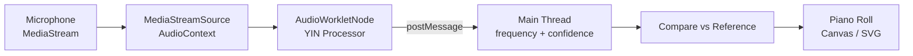
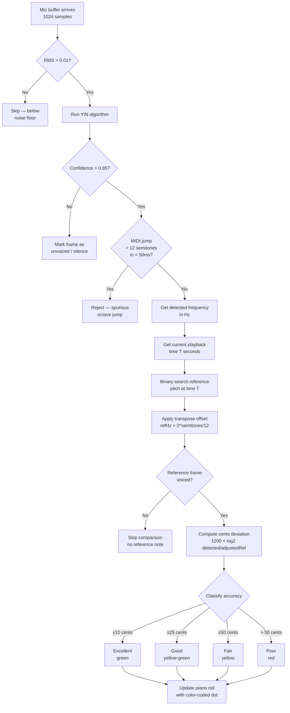
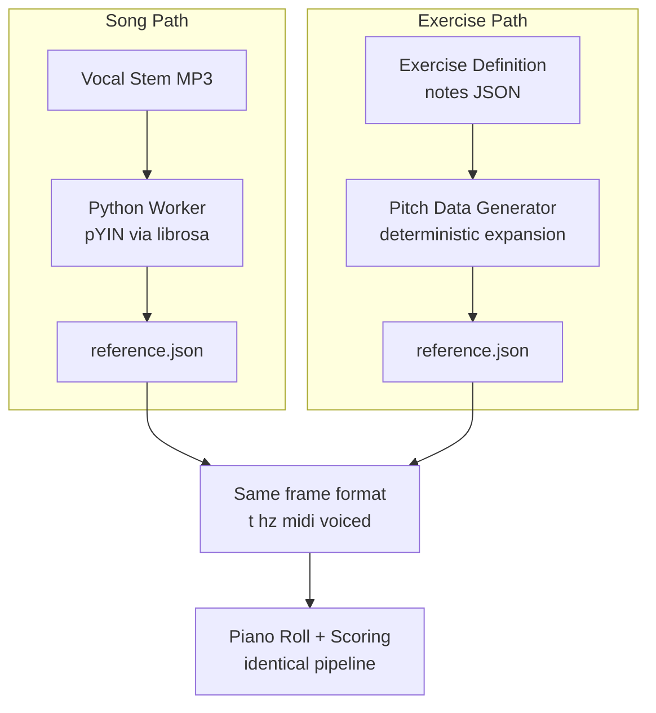

# Intonavio — Real-Time Pitch Detection

## Overview

Real-time pitch detection is the core interactive feature. The app captures the singer's voice via microphone, detects the fundamental frequency (F0), compares it against the reference pitch at the current playback time, and provides visual feedback on a piano roll.

---

## iOS Audio Graph



### iOS Implementation Notes

- **AVAudioEngine** provides low-latency access to the microphone input node
- **installTap** with buffer size 1024 at 44.1kHz gives callbacks every ~23ms
- **YIN algorithm** runs synchronously in the tap callback (audio thread)
- Detected pitch is dispatched to main thread for UI update
- The reference pitch array is binary-searched by timestamp for O(log n) lookup

### Audio Session: Echo Cancellation

The audio session uses `.voiceChat` mode (not `.default`) to enable iOS built-in Acoustic Echo Cancellation (AEC). This removes speaker audio from the mic input — critical when playing music through the speaker while recording the singer's voice. Without AEC, the microphone picks up the song's melody and the detected pitch line follows the music rather than the user's voice.

```swift
AVAudioSession.sharedInstance().setCategory(
    .playAndRecord,
    mode: .voiceChat,  // Enables AEC + noise suppression
    options: [.defaultToSpeaker, .allowBluetooth, .mixWithOthers]
)
```

### Pre-Detection Filtering

Three filters prevent false detections:

1. **RMS noise gate**: Before running YIN, compute RMS via `vDSP_rmsqv` (Accelerate framework). If RMS < 0.01 (~-40 dB), skip detection entirely. This filters true silence after AEC removes the music.
2. **Confidence threshold**: Set to 0.85 (stricter than the typical 0.80). Rejects low-confidence detections from residual noise.
3. **MIDI jump filter**: Reject detections where MIDI jumps >12 semitones (1 octave) within 50ms of the previous detection. This catches spurious octave jumps from harmonic confusion.

```swift
// Pseudocode for iOS pitch detection
let audioEngine = AVAudioEngine()
let inputNode = audioEngine.inputNode
let format = inputNode.outputFormat(forBus: 0) // 44.1kHz

inputNode.installTap(onBus: 0, bufferSize: 1024, format: format) { buffer, time in
    let samples = Array(UnsafeBufferPointer(
        start: buffer.floatChannelData?[0],
        count: Int(buffer.frameLength)
    ))

    // RMS noise gate
    var rms: Float = 0
    vDSP_rmsqv(samples, 1, &rms, vDSP_Length(samples.count))
    guard rms >= 0.01 else { return }

    let (frequency, confidence) = yinDetect(samples, sampleRate: format.sampleRate)

    if confidence > 0.85 {
        DispatchQueue.main.async {
            self.updatePianoRoll(detectedHz: frequency, at: currentPlaybackTime)
        }
    }
}
```

---

## Web Audio Graph



### Web Implementation Notes

- **AudioWorklet** runs pitch detection off the main thread for smooth UI
- The worklet processor accumulates samples until it has 1024, then runs YIN
- Results are sent via `postMessage` to the main thread
- Reference pitch data is pre-loaded as a typed array for fast lookup

---

## Pitch Comparison Flow



---

## Scoring Thresholds

| Category  | Cents Deviation | Color        | Points |
| --------- | --------------- | ------------ | ------ |
| Excellent | ±10 cents       | Green        | 100%   |
| Good      | ±25 cents       | Yellow-green | 75%    |
| Fair      | ±50 cents       | Yellow       | 50%    |
| Poor      | > 50 cents      | Red          | 0%     |

**Cents formula (with transpose):**

```
adjustedRefHz = referenceHz × 2^(transposeSemitones / 12)
cents = 1200 × log₂(detectedHz / adjustedRefHz)
```

When `transposeSemitones = 0`, this reduces to the standard formula. One semitone = 100 cents. A deviation of ±50 cents means the singer is halfway to the wrong note.

**Overall session score:**

```
score = (sum of frame scores / number of voiced reference frames) × 100
```

Only frames where the reference vocal is voiced are counted — silence, breaths, and instrumental sections are excluded.

---

## Reference Pitch Transpose

Users can shift the reference pitch graph up or down by musical intervals to practice in a different vocal register. This is a **visual + scoring shift only** — no audio processing is applied to the playback.

### Available Intervals

| Interval         | Semitones | Label  |
| ---------------- | --------- | ------ |
| 2 octaves down   | -24       | -2 oct |
| Octave down      | -12       | -1 oct |
| Fifth down       | -7        | -5th   |
| Fourth down      | -5        | -4th   |
| Major third down | -4        | -M3    |
| Minor third down | -3        | -m3    |
| Unison (default) | 0         | 0      |
| Minor third up   | +3        | +m3    |
| Major third up   | +4        | +M3    |
| Fourth up        | +5        | +4th   |
| Fifth up         | +7        | +5th   |
| Octave up        | +12       | +1 oct |
| 2 octaves up     | +24       | +2 oct |

### Where Transpose Applies

| Component              | Transposed? | Why                                                    |
| ---------------------- | ----------- | ------------------------------------------------------ |
| Reference zones/lines  | Yes         | MIDI notes shifted by `transposeOffset` on piano roll  |
| Reference Hz (scoring) | Yes         | `refHz × 2^(semitones/12)` before cents calculation    |
| Detected pitch display | No          | User's voice shown at actual position                  |
| MIDI range (Y-axis)    | Yes         | Piano roll range shifts to keep transposed ref visible |
| Audio playback         | No          | No pitch-shifting of stems or YouTube audio            |

### Implementation

- `TransposeInterval` enum (`Audio/Pitch/TransposeInterval.swift`) holds all intervals with `rawValue` as semitone offset
- `PracticeViewModel.transposeSemitones` drives both scoring and rendering
- `ScoringEngine.transposeSemitones` shifts reference before `centsBetween()` calculation
- `PianoRollRenderer.transposeOffset` shifts reference draw positions (zones and lines)
- Transpose resets to 0 when navigating away from practice

---

## Piano Roll Visualization

The piano roll is a scrolling 2D display shared by both song practice and exercise practice views (see `docs/16-ui-views-flow.md`):

- **Y-axis**: Piano keys / MIDI note numbers (pitch), labeled with note names (C4, D4, E4...)
- **X-axis**: Time, scrolling left as playback progresses
- **Current note**: Displayed large on the left side, with cents deviation indicator

### Visualization Modes

The user toggles between 3 modes via a segmented control on the pitch graph:

| Mode             | Reference Display              | User Display                                 | Feel                |
| ---------------- | ------------------------------ | -------------------------------------------- | ------------------- |
| **Zones + Line** | Semi-transparent colored bands | Solid colored line (accuracy colors)         | Clean, analytical   |
| **Two Lines**    | Thin dashed gray line          | Bold colored line (same color scheme)        | Direct comparison   |
| **Zones + Glow** | Semi-transparent bands         | Glowing animated trail, intensity = accuracy | Engaging, game-like |

### Rendering Specs

| Property             | Value                                                                    |
| -------------------- | ------------------------------------------------------------------------ |
| Visible time window  | 8 seconds (4s past + 4s future)                                          |
| Y-axis range         | Dynamic, centered on current note ±1 octave                              |
| Update rate          | ~43 FPS (matching audio callback rate)                                   |
| Reference bar height | 1 semitone                                                               |
| Dot size             | 4pt                                                                      |
| Transpose offset     | Applied to reference draws only; detected pitch stays at actual position |

---

## Buffer Size vs Latency Tradeoffs

| Buffer Size | Duration @ 44.1kHz | Frequency Resolution | Latency  | Use Case                               |
| ----------- | ------------------ | -------------------- | -------- | -------------------------------------- |
| 512         | 11.6ms             | ~86 Hz               | Very low | Too imprecise below ~170 Hz            |
| **1024**    | **23.2ms**         | **~43 Hz**           | **Low**  | **Best balance for singing (default)** |
| 2048        | 46.4ms             | ~21 Hz               | Medium   | Better for bass voices                 |
| 4096        | 92.9ms             | ~10 Hz               | High     | Too sluggish for real-time feedback    |

**Why 1024?**

- 23ms latency is imperceptible for visual feedback
- 43 Hz resolution covers notes down to ~F1, well below typical singing range
- YIN at 1024 samples completes in <1ms on modern hardware

---

## YIN Algorithm Summary

YIN is an autocorrelation-based pitch detection algorithm optimized for monophonic audio (single voice).

**Steps:**

1. Compute the difference function (autocorrelation variant)
2. Cumulative mean normalized difference
3. Absolute threshold (τ where d'(τ) < threshold)
4. Parabolic interpolation for sub-sample accuracy
5. Convert lag to frequency: `f = sampleRate / lag`

**Why YIN over alternatives?**

| Algorithm    | Pros                                       | Cons                               | Used In              |
| ------------ | ------------------------------------------ | ---------------------------------- | -------------------- |
| **YIN**      | Fast, accurate for monophonic, low latency | Requires tuning threshold          | iOS & Web real-time  |
| **pYIN**     | Probabilistic, handles vibrato better      | Slower (batch processing)          | Server-side analysis |
| **FFT peak** | Simple                                     | Poor resolution at low frequencies | Not used             |
| **CREPE**    | Neural net, very accurate                  | Too slow for real-time on mobile   | Not used             |

The iOS and Web clients use classic YIN for real-time detection. The Python worker uses pYIN (via librosa) for offline reference pitch extraction where accuracy matters more than speed.

---

## Reference Pitch Sources

The piano roll and scoring pipeline consume the same `{t, hz, midi, voiced}` frame array regardless of whether the reference comes from a song or an exercise. The only difference is how the reference is produced.



### Exercise Pitch Data Generation

The generator expands an exercise note definition (see [[04-data-models]]) into frame-by-frame pitch data at the same 11.6ms hop interval used by pYIN extraction.

**Algorithm:**

1. Read exercise `notes` array and `tempo` (BPM)
2. Convert beat durations to seconds: `seconds = beats × 60 / tempo`
3. For each note, generate frames at 11.6ms intervals:
   - **Sustained note**: all frames at `baseHz = 440 × 2^((midi - 69) / 12)`
   - **With vibrato**: modulate each frame: `hz = baseHz × 2^(vibratoCents × sin(2π × rateHz × t) / 1200)`
   - **Rest period**: generate unvoiced frames (`hz: null, voiced: false`)
4. Write the complete frame array as the same JSON format used by songs
5. Upload to R2 at `pitch/{exerciseId}/reference.json`

**Example: C4 sustained for 2 beats at 80 BPM with vibrato**

- Duration: 2 × 60/80 = 1.5 seconds = ~129 frames
- Base frequency: 261.63 Hz (MIDI 60)
- Each frame: `hz = 261.63 × 2^(30 × sin(2π × 5.5 × t) / 1200)`

The result is a smooth pitch curve that oscillates ±30 cents around C4 at 5.5 Hz — the singer must match this curve to score well on vibrato exercises.

### Why This Works

The client never needs to know whether it's practicing a song or an exercise. It loads a reference pitch JSON, plays back (stems for songs, metronome/guide tone for exercises), captures the singer's pitch, and compares frame by frame. The piano roll renders identically in both cases.
