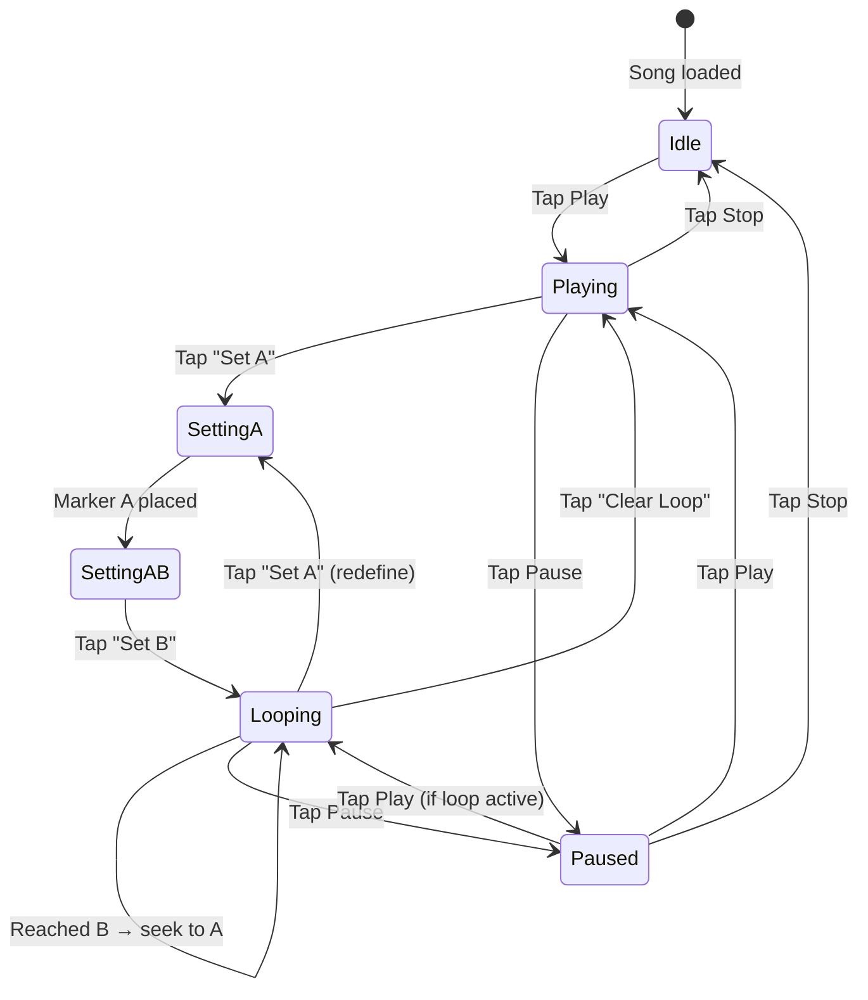
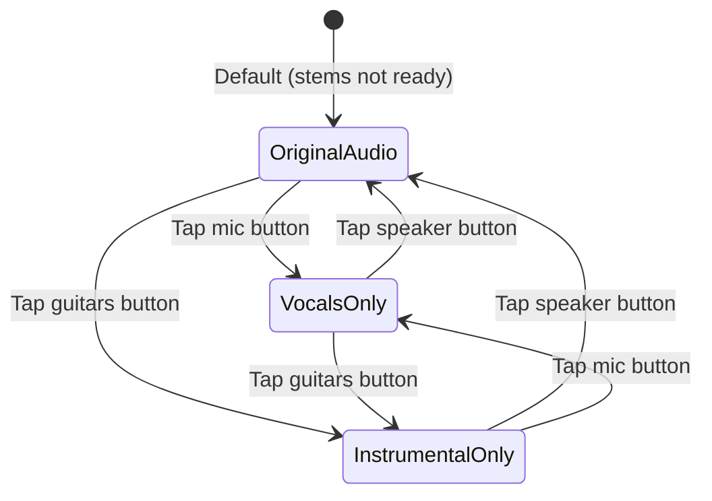
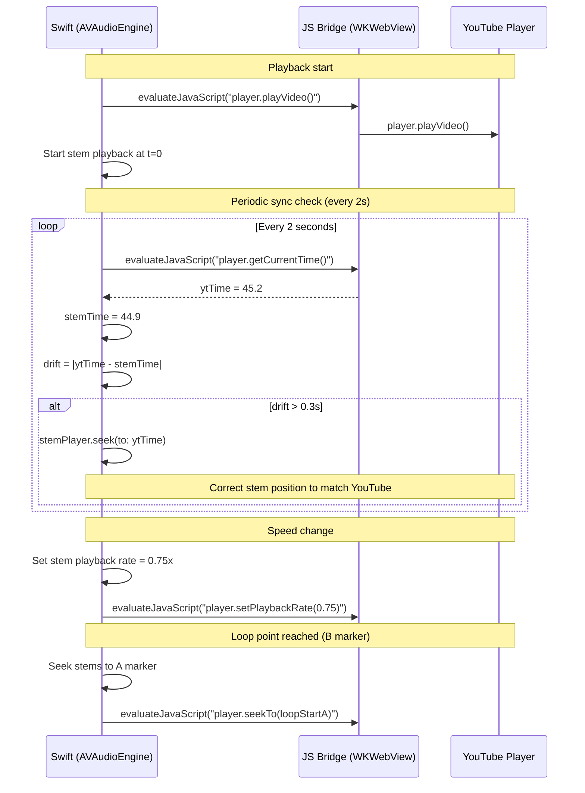

# Intonavio — YouTube Looping & Playback

## Overview

Intonavio embeds YouTube lyrics videos and provides A-B looping, speed control, and the ability to switch between original audio and separated stems. On iOS, YouTube playback happens in a WKWebView using the YouTube IFrame Player API, controlled via a Swift ↔ JavaScript bridge.

---

## Loop State Machine



### State Descriptions

| State         | Description                                                           |
| ------------- | --------------------------------------------------------------------- |
| **Idle**      | Song loaded, not playing. No loop markers set.                        |
| **Playing**   | Video/stems playing without loop.                                     |
| **SettingA**  | User tapped "Set A" — marker A placed at current time. Waiting for B. |
| **SettingAB** | Both A and B positions known. Not yet looping (transition state).     |
| **Looping**   | Playback loops between A and B. On reaching B, seeks back to A.       |
| **Paused**    | Playback paused. Loop markers preserved.                              |

---

## Audio Mode State

Switching between original YouTube audio and separated stems.



### Audio Modes

| Mode                  | YouTube Audio | Stem Playback           | Use Case                                         | UI Control             |
| --------------------- | ------------- | ----------------------- | ------------------------------------------------ | ---------------------- |
| **Original Audio**    | Unmuted       | None                    | Before stems are ready, or user prefers original | Speaker icon button    |
| **Vocals Only**       | Muted         | Vocals stem only        | Listen to reference vocal isolated               | Microphone icon button |
| **Instrumental Only** | Muted         | All stems except vocals | Sing along without competing vocal               | Guitars icon button    |

Audio source buttons appear inline in the controls bar (next to A-B loop controls) once stems are downloaded. Before stems are ready, YouTube original plays by default with no source buttons shown.

**Mode switching uses pause-switch-resume:** stop sync → stop stems → change mode/volumes → restart stems from current YouTube time → restart sync. This prevents race conditions where the sync system sees inconsistent state during transitions.

---

## Video-Audio Sync Flow

When playing stems instead of YouTube audio, the video must stay in sync with stem playback.



### Sync Rules

- **YouTube is the master clock** — stem audio follows it. This prevents stems restarting at time 0 from pulling the video back to the beginning during mode switches.
- Drift tolerance: **±300ms**. Beyond this, stems seek to match YouTube time. The 300ms threshold prevents constant micro-corrections (150ms triggered corrections every cycle due to inherent JS bridge latency).
- Sync poll interval: **2 seconds**. Frequent polling (1s) caused excessive corrections without improving perceived sync.
- Speed changes are applied to both stem playback (`AVAudioUnitTimePitch.rate`) and YouTube player (`setPlaybackRate()`) simultaneously.
- On loop restart (B→A), both stem and video seek to marker A.
- `AVAudioSession` uses `.mixWithOthers` option so YouTube WebView and AVAudioEngine coexist without triggering interruption notifications that would stop the engine.

---

## Speed Control

| Speed | Label     | Use Case                              |
| ----- | --------- | ------------------------------------- |
| 0.25x | Very slow | Learning complex melisma note by note |
| 0.5x  | Slow      | Breaking down fast passages           |
| 0.75x | Moderate  | Comfortable practice speed            |
| 1.0x  | Normal    | Full speed performance                |
| 1.25x | Fast      | Challenge mode                        |
| 1.5x  | Faster    | Advanced practice                     |
| 2.0x  | Double    | Quick review                          |

Speed is applied via:

- **AVAudioEngine**: `audioPlayerNode.rate = speed` (using AVAudioUnitTimePitch to preserve pitch)
- **YouTube**: `player.setPlaybackRate(speed)` — YouTube supports 0.25x–2x natively

For speeds above 2x (if needed later), the YouTube video would be paused and only stems played.

---

## iOS Implementation: WKWebView + YouTube IFrame API

### HTML Template (loaded in WKWebView)

```html
<!DOCTYPE html>
<html>
  <body style="margin:0; background:#000;">
    <div id="player"></div>
    <script src="https://www.youtube.com/iframe_api"></script>
    <script>
      var player;
      function onYouTubeIframeAPIReady() {
        player = new YT.Player('player', {
          videoId: 'VIDEO_ID',
          playerVars: { controls: 0, modestbranding: 1, rel: 0, playsinline: 1 },
          events: { onReady: onPlayerReady, onStateChange: onPlayerStateChange },
        });
      }
      function onPlayerReady(e) {
        window.webkit.messageHandlers.ytEvent.postMessage({ event: 'ready' });
      }
      function onPlayerStateChange(e) {
        window.webkit.messageHandlers.ytEvent.postMessage({
          event: 'stateChange',
          state: e.data,
        });
      }
    </script>
  </body>
</html>
```

### Swift ↔ JS Bridge

| Direction  | Method                                               | Purpose            |
| ---------- | ---------------------------------------------------- | ------------------ |
| Swift → JS | `evaluateJavaScript("player.playVideo()")`           | Control playback   |
| Swift → JS | `evaluateJavaScript("player.seekTo(time)")`          | Seek to time       |
| Swift → JS | `evaluateJavaScript("player.setPlaybackRate(rate)")` | Change speed       |
| Swift → JS | `evaluateJavaScript("player.getCurrentTime()")`      | Read position      |
| Swift → JS | `evaluateJavaScript("player.mute()")`                | Mute YouTube audio |
| JS → Swift | `WKScriptMessageHandler` (`ytEvent`)                 | Player events      |

---

## Keyboard / Gesture Shortcuts

### iOS (Touch)

| Gesture                | Action                  |
| ---------------------- | ----------------------- |
| Tap play/pause         | Toggle playback         |
| Long press on timeline | Set A marker            |
| Second long press      | Set B marker            |
| Double-tap loop badge  | Clear loop              |
| Pinch timeline         | Zoom in/out on waveform |
| Swipe left/right       | Scrub ±5 seconds        |

### Web (Keyboard)

| Key                   | Action                                                         |
| --------------------- | -------------------------------------------------------------- |
| `Space`               | Play / Pause                                                   |
| `[`                   | Set A marker at current time                                   |
| `]`                   | Set B marker at current time                                   |
| `Backspace`           | Clear loop                                                     |
| `←` / `→`             | Seek ±5 seconds                                                |
| `Shift+←` / `Shift+→` | Seek ±1 second                                                 |
| `-` / `+`             | Decrease / increase speed by 0.25x                             |
| `M`                   | Toggle mute vocals                                             |
| `1`–`5`               | Solo stem (1=vocals, 2=instrumental, 3=drums, 4=bass, 5=other) |
