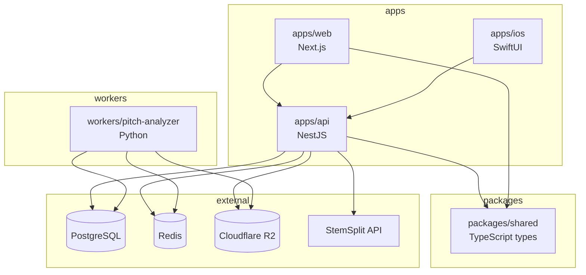

# Intonavio — Project Structure

## Monorepo Layout

```
intonavio/
├── apps/
│   ├── api/                        # NestJS backend
│   │   ├── src/
│   │   │   ├── auth/               # Apple Sign In, JWT, guards
│   │   │   ├── songs/              # Song CRUD, YouTube metadata
│   │   │   │   ├── dto/           # Request/response DTOs
│   │   │   │   └── utils/         # YouTube URL parsing
│   │   │   ├── stems/              # Stem records, R2 presigned URLs
│   │   │   │   └── dto/           # Stem response DTOs
│   │   │   ├── sessions/           # Practice session CRUD
│   │   │   │   └── dto/           # Session request/response DTOs
│   │   │   ├── jobs/               # BullMQ producers, job state
│   │   │   │   ├── adapters/      # External service adapters (StemSplit)
│   │   │   │   ├── interfaces/    # Job data types
│   │   │   │   └── processors/    # Job processors (stem-split)
│   │   │   ├── webhooks/           # StemSplit webhook handler
│   │   │   │   ├── dto/           # Webhook payload DTOs
│   │   │   │   └── guards/        # Webhook secret guard
│   │   │   ├── health/              # Health check endpoints
│   │   │   │   └── indicators/    # Prisma + Redis health indicators
│   │   │   ├── storage/            # R2 upload/download service
│   │   │   ├── common/             # Shared guards, filters, pipes
│   │   │   ├── prisma/             # Prisma service, module
│   │   │   ├── test/               # Shared test utilities
│   │   │   │   ├── test-utils.ts   # App builder, JWT generator, mock factories
│   │   │   │   └── fixtures/       # Test data (songs, webhooks)
│   │   │   └── main.ts
│   │   ├── prisma/
│   │   │   ├── schema.prisma
│   │   │   └── migrations/
│   │   ├── test/                    # E2E tests
│   │   │   ├── app.e2e-spec.ts     # Full API integration tests
│   │   │   └── jest-e2e.json
│   │   ├── Dockerfile
│   │   └── package.json
│   │
│   ├── web/                        # Next.js web client
│   │   ├── src/
│   │   │   ├── app/                # App router pages
│   │   │   ├── components/         # React components
│   │   │   │   ├── piano-roll/     # Pitch visualization
│   │   │   │   ├── youtube-player/ # YouTube embed + controls
│   │   │   │   ├── loop-controls/  # A-B loop UI
│   │   │   │   └── stem-mixer/     # Stem volume/solo/mute
│   │   │   ├── hooks/              # Custom React hooks
│   │   │   ├── lib/                # API client, audio utils
│   │   │   ├── workers/            # AudioWorklet processors
│   │   │   │   └── yin-processor.js
│   │   │   └── styles/
│   │   ├── public/
│   │   └── package.json
│   │
│   └── ios/                        # SwiftUI iOS/macOS app
│       ├── Intonavio/
│       │   ├── App/                # App entry, tab navigation
│       │   ├── Features/
│       │   │   ├── Auth/           # Sign In, Sign Up views
│       │   │   ├── Library/        # Home (song grid + exercises)
│       │   │   │   ├── HomeView.swift
│       │   │   │   ├── AddSongSheet.swift
│       │   │   │   └── ExerciseBrowserView.swift
│       │   │   ├── Practice/       # Song + exercise practice screens
│       │   │   │   ├── SongPracticeView.swift
│       │   │   │   ├── ExercisePracticeView.swift
│       │   │   │   ├── PianoRollView.swift
│       │   │   │   ├── LoopControlsView.swift
│       │   │   │   └── StemMixerView.swift
│       │   │   ├── Sessions/       # Session history + detail
│       │   │   └── Settings/       # Settings, Profile/Community
│       │   ├── Audio/
│       │   │   ├── PitchDetector.swift      # YIN implementation
│       │   │   ├── AudioEngineManager.swift # AVAudioEngine setup
│       │   │   └── StemPlayer.swift         # Multi-stem playback
│       │   ├── YouTube/
│       │   │   ├── YouTubePlayerView.swift  # WKWebView wrapper
│       │   │   └── youtube-player.html      # IFrame API template
│       │   ├── Networking/
│       │   │   ├── APIClient.swift
│       │   │   └── Models/         # Codable API models
│       │   └── Utilities/
│       ├── IntonavioTests/
│       └── Intonavio.xcodeproj
│
├── packages/
│   └── shared/                     # Shared TypeScript types
│       ├── src/
│       │   ├── types.ts            # Song, Stem, Session types
│       │   ├── enums.ts            # SongStatus, StemType
│       │   └── pitch.ts            # Pitch data format types
│       └── package.json
│
├── workers/
│   └── pitch-analyzer/             # Python pitch analysis worker
│       ├── src/
│       │   ├── __init__.py         # Package marker (empty)
│       │   ├── config.py           # pydantic-settings env config
│       │   ├── logger.py           # Structured JSON logging
│       │   ├── models.py           # Pydantic models (job data, output)
│       │   ├── consumer.py         # BullMQ Worker wrapper + heartbeat
│       │   ├── analyzer.py         # pYIN pitch extraction via librosa
│       │   ├── storage.py          # R2 download/upload via boto3
│       │   ├── db.py               # PostgreSQL upserts via psycopg2
│       │   └── worker.py           # Job orchestrator + main()
│       ├── tests/
│       │   ├── conftest.py         # Shared fixtures (config, wav gen)
│       │   ├── test_analyzer.py    # pYIN extraction tests (19 tests)
│       │   ├── test_config.py      # Config validation tests
│       │   ├── test_db.py          # DB adapter tests (mocked)
│       │   ├── test_models.py      # Pydantic model tests
│       │   ├── test_storage.py     # R2 adapter tests (mocked)
│       │   └── test_worker.py      # Orchestrator integration tests
│       ├── requirements.txt
│       ├── requirements-dev.txt
│       ├── Dockerfile
│       └── pyproject.toml
│
├── docs/                           # This documentation
│   ├── 01-overview.md
│   ├── ...
│   └── 11-spikes.md
│
├── docker-compose.dev.yml          # Local dev: PostgreSQL + Redis only
├── docker-compose.prod.yml         # Production: all services
├── turbo.json                      # Turborepo config
├── package.json                    # Root package.json
├── pnpm-workspace.yaml
└── .github/
    ├── ISSUE_TEMPLATE/
    │   ├── bug_report.md
    │   └── feature_request.md
    └── workflows/
        ├── ci.yml                  # Lint + test on every PR
        ├── deploy.yml              # Build images + deploy to Hostinger KVM
        └── backup.yml              # Scheduled DB backup to R2
```

---

## Package Dependency Graph



---

## Tech Stack Per Directory

| Directory                | Language    | Runtime             | Key Dependencies                                                |
| ------------------------ | ----------- | ------------------- | --------------------------------------------------------------- |
| `apps/api`               | TypeScript  | Node.js 20          | NestJS, Prisma, BullMQ, `@aws-sdk/client-s3` (R2)               |
| `apps/web`               | TypeScript  | Node.js 20          | Next.js 14, React 18, Tailwind CSS                              |
| `apps/ios`               | Swift       | iOS 17+ / macOS 14+ | SwiftUI, AVFoundation, WebKit                                   |
| `packages/shared`        | TypeScript  | —                   | Zod (validation), shared types                                  |
| `workers/pitch-analyzer` | Python 3.11 | —                   | librosa, numpy, boto3 (R2), psycopg2, bullmq, pydantic-settings |

---

## Build & Development

### Turborepo Tasks

```json
{
  "pipeline": {
    "build": { "dependsOn": ["^build"] },
    "dev": { "cache": false, "persistent": true },
    "lint": {},
    "test": { "dependsOn": ["build"] },
    "db:push": { "cache": false },
    "db:generate": { "cache": false }
  }
}
```

### Common Commands

| Command            | Description                    |
| ------------------ | ------------------------------ |
| `pnpm dev`         | Start API + Web in dev mode    |
| `pnpm build`       | Build all TypeScript packages  |
| `pnpm lint`        | Lint all packages              |
| `pnpm test`        | Run all tests                  |
| `pnpm db:push`     | Push Prisma schema to database |
| `pnpm db:generate` | Generate Prisma client         |

### iOS Development

- Open `apps/ios/Intonavio.xcodeproj` in Xcode
- Requires Xcode 15+ and iOS 17+ simulator or device
- No Turborepo integration — developed separately in Xcode
