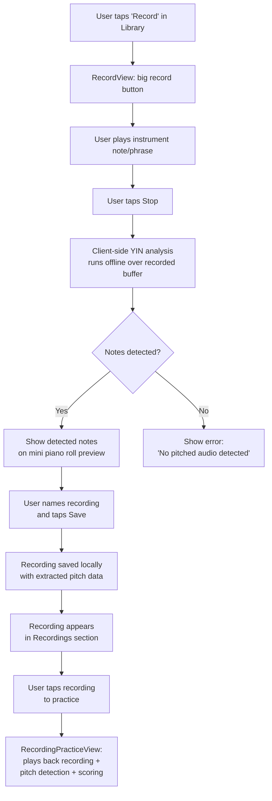
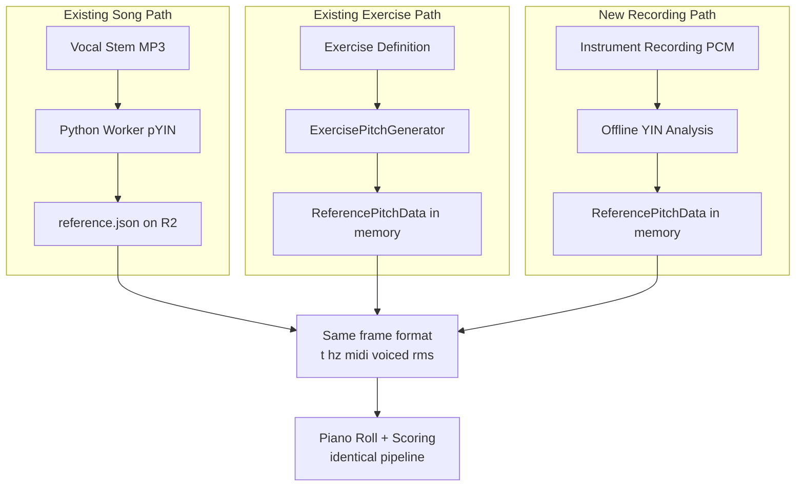
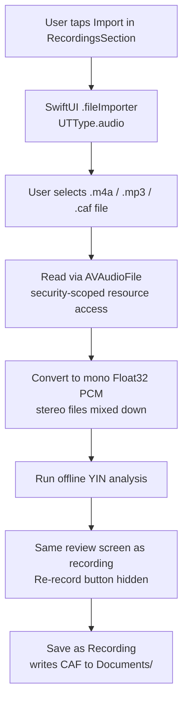

# Intonavio — Instrument Recording & Custom Exercises

## Overview

Instrument Recording enables singers who play any pitched instrument (guitar, piano, ukulele, violin, etc.) to record individual notes or short melodic phrases, analyze the pitch from the recording, and use the extracted notes as vocal exercises. The feature bridges the gap between instrument practice and vocal training — play a note on your instrument, then sing it back with real-time pitch feedback.

This works with any monophonic pitched sound: guitar notes, piano keys, humming, whistling, a tuning fork — anything that produces a clear fundamental frequency. YIN pitch detection is instrument-agnostic.

This feature reuses the existing exercise practice infrastructure (piano roll, scoring engine, reference pitch store) with a new input source: user-recorded audio instead of pre-defined note sequences or server-extracted vocal stems.

---

## User Flow

```
Record instrument note(s) → Auto-analyze pitch → Save as custom exercise → Practice (sing along with scoring)
```

### Detailed Flow



---

## Design Decisions

### Client-Side Pitch Analysis (No Server Round-Trip)

Pitch analysis runs entirely on-device using the existing `YINDetector`. Rationale:

- **Single notes are monophonic** — YIN handles this well (it's already proven for real-time voice detection).
- **Recordings are short** — typically 1-30 seconds. Offline YIN over a short buffer completes in <1 second.
- **No network dependency** — the feature works offline after initial app download.
- **No server cost** — no R2 storage, no worker processing, no API calls.

The Python worker's pYIN is unnecessary here — YIN is sufficient for clean, close-mic'd instrument recordings where the signal-to-noise ratio is high.

### Local-Only Storage (Phase 1)

Recordings and their pitch data are stored locally using SwiftData. No server sync in Phase 1. This keeps the feature simple and avoids data model changes on the backend. Server sync can be added later if users want cross-device access.

### Monophonic Only (Single Notes)

YIN detects one pitch at a time. For chords (guitar strums, piano clusters), it locks onto the dominant frequency — it does not identify chord voicings. This is acceptable because the use case is vocal exercises: the singer matches one pitch at a time. If the user plays a chord, the detected root/dominant note becomes the exercise target.

Future: chord detection could be added via `librosa.piptrack` or chroma-based analysis on the server, but this is out of scope for the initial implementation.

### Instrument-Agnostic Design

The feature does not distinguish between instruments. YIN detects the fundamental frequency of any pitched sound within the 80–1100 Hz range. This covers:

| Instrument        | Approximate Range          | Covered?                                                         |
| ----------------- | -------------------------- | ---------------------------------------------------------------- |
| Guitar (standard) | E2 (82 Hz) – E6 (1319 Hz)  | Yes (most frets; highest frets on high E slightly above 1100 Hz) |
| Piano             | A0 (27 Hz) – C8 (4186 Hz)  | Partial (A2–C6 well covered; below A2 too low for YIN)           |
| Ukulele           | C4 (262 Hz) – A5 (880 Hz)  | Yes (full range)                                                 |
| Violin            | G3 (196 Hz) – E7 (2637 Hz) | Partial (lower positions well covered)                           |
| Voice (humming)   | ~80 Hz – ~1000 Hz          | Yes                                                              |
| Whistling         | ~500 Hz – ~4000 Hz         | Partial (lower range covered)                                    |

The 80–1100 Hz range covers the practical singing range and the most commonly used instrument registers for vocal exercises. No constant changes needed.

---

## Architecture

### How It Fits the Existing System



The recording path produces the same `ReferencePitchData` that songs and exercises use. Once pitch data is extracted, all downstream components (ReferencePitchStore, ScoringEngine, PianoRollRenderer) work without modification.

### Audio Recording Architecture

Recording uses the existing shared `AudioEngine` mic tap. A new `AudioRecorder` component accumulates PCM samples from the tap into a buffer, then writes to disk when recording stops.

```
Microphone --> inputNode (VP/AEC) --> tap --> AudioRecorder (accumulates PCM)
                                         --> PitchDetector (real-time, optional during recording)
```

Key constraint: the tap callback runs on the audio thread. `AudioRecorder` must not allocate memory or perform I/O in the callback — it writes into a pre-allocated ring buffer, and a background thread flushes to disk.

### Offline Pitch Analysis

After recording stops, `RecordingAnalyzer` runs YIN over the saved PCM buffer in a background task:

1. Load the recorded PCM buffer (already in memory or read from disk).
2. Slide a 2048-sample YIN window with 256-sample hops (same parameters as real-time detection).
3. Apply RMS noise gate and confidence threshold.
4. Build `[ReferencePitchFrame]` array — same format as song/exercise pitch data.
5. Run note segmentation: group consecutive frames at the same MIDI note (within +/-1 semitone) into discrete notes.
6. Store the result alongside the recording.

---

## Data Model (Local — SwiftData)

Recordings are stored locally on-device. No server-side model changes in Phase 1.

```swift
@Model
final class Recording {
    var id: UUID
    var name: String
    var duration: TimeInterval          // seconds
    var audioFileName: String           // relative path in app Documents
    var pitchFrames: Data               // JSON-encoded [ReferencePitchFrame]
    var detectedNotes: Data             // JSON-encoded [DetectedNote]
    var createdAt: Date

    // Derived from detectedNotes for display
    var noteCount: Int
    var lowestMidi: Int
    var highestMidi: Int
}
```

```swift
struct DetectedNote: Codable {
    let midi: Int                       // MIDI note number (rounded)
    let name: String                    // "E4", "A3", etc.
    let startTime: TimeInterval         // seconds from recording start
    let duration: TimeInterval          // seconds
    let averageHz: Double               // mean frequency across frames
    let confidence: Double              // average YIN confidence
}
```

### Storage Layout

```
Documents/
  recordings/
    {uuid}/
      audio.caf                         // Core Audio Format (lossless, fast to write)
      metadata.json                     // Recording model as JSON (backup)
```

CAF (Core Audio Format) is chosen over M4A/MP3 because:

- No encoding overhead during recording (raw PCM write).
- Native to AVAudioEngine — no format conversion needed.
- Lossless — important for accurate offline pitch analysis.

---

## iOS Views

### New Views (4 total)

#### 1. RecordingsSection (in HomeView)

New section in the Library tab, below Exercises. Shows a horizontal scroll of recording cards.

```
Home (Library Tab)
  Song Library grid
  Exercises section
  Recordings section        <-- NEW
    [+ Record]  [+ Import]  [Recording 1]  [Recording 2]  ...
```

Each card shows: name, note count. The `[+ Record]` card opens RecordView as sheet. The `[+ Import]` card opens the system file picker. Long-press a recording card for delete option.

#### 2. RecordView

Full-screen recording interface. Minimal UI to avoid distraction while playing.

```
+-------------------------------+
|  <- Back          Recording   |
|                               |
|     Live waveform / level     |
|     meter (during recording)  |
|                               |
|      Detected note: E4        |
|      (real-time, optional)    |
|                               |
|         [ RECORD ]            |
|     big circular button       |
|     red when recording        |
|                               |
|       00:00 / 0:30 max        |
+-------------------------------+
```

States:

- **Idle**: Record button shown. Tap to start.
- **Recording**: Button pulses red. Live audio level meter. Optional real-time note display. Tap to stop. Auto-stops at 30 seconds.
- **Analyzing**: Spinner with "Analyzing pitch..." (typically <1s).
- **Review**: Shows detected notes on a mini piano roll. Name field. Save / Re-record buttons.

#### 3. RecordingPracticeView

Reuses the `ExercisePracticeView` pattern. Plays back the recording audio while the singer matches pitch.

```
+-------------------------------+
|  <- Back    "My E4 Note"  ✎  |
|   [Loop: A4]       3.2s      |
+-------------------------------+
|   Piano Roll (full width)     |
|   [reference from recording]  |
|   [detected voice line]       |
+-------------------------------+
| [progress bar]                |
| [restart] [play/pause]        |
| [transpose ↕] [0.5x 1x 1.5x]|
| [zones | line | notes]        |
+-------------------------------+
| Practice Complete             |
| Score: 85%  Score saved       |
| [Try Again]                   |
+-------------------------------+
```

Components reused from exercise practice:

- `PianoRollView` (piano roll + gestures)
- `ScoringEngine` (cents comparison, transpose-aware)
- `ReferencePitchStore` (loaded from recording's pitch frames)
- `PitchDetector` (real-time voice detection)
- `TransposeInterval` (musical interval picker)
- `ScoreRepository` (score history persistence)

New components:

- `AVAudioPlayerNode → AVAudioUnitTimePitch → mainMixer` for recording playback with speed control
- Transpose picker and speed selector in practice controls
- Loop indicator in header (tap to clear)
- Toolbar edit button (pencil icon) opens `RecordingNoteEditorView`

#### 4. RecordingNoteEditorView

Sheet for editing detected notes. Accessible via toolbar pencil icon in practice view.

- List of detected notes with swipe-to-delete
- Per-note pitch adjustment (+/- semitone buttons)
- Loop button per note (sets loop range, dismisses to practice)
- Save applies edits back to pitch frames in SwiftData

### Navigation

```
Library (Home)
  ...existing...
  Recordings section
    [+ Record] --> RecordView (sheet)
    [+ Import] --> File picker --> RecordView in import mode (sheet)
    [Recording card] --> RecordingPracticeView (push)
      [✎ toolbar] --> RecordingNoteEditorView (sheet)
    [Long-press card] --> Delete confirmation
```

---

## Import from Voice Memos / Files

The `[+ Import]` card in RecordingsSection opens a SwiftUI `.fileImporter()` with `UTType.audio`. The same `RecordView` is reused in import mode (title changes to "Import", record button hidden, goes straight to analyzing).

### Import Flow



Supported formats: `.m4a` (Voice Memos default), `.mp3`, `.wav`, `.caf`, `.aiff` — anything `AVAudioFile` can read.

### Implementation

- `RecordViewModel.importAudioFile(url:)` — reads audio file with security-scoped resource access, converts to mono PCM, runs `RecordingAnalyzer.analyze()`.
- `RecordViewModel.readAudioFile(url:)` — handles stereo-to-mono mixdown, returns `([Float], Double)`.
- `RecordViewModel.writeCAF(samples:sampleRate:directory:)` — writes imported samples as CAF for consistent playback.
- `RecordView(importURL:)` — accepts optional URL, triggers import on appear via `.task`.
- `RecordingsSectionView` — `[+ Import]` card with `doc.badge.plus` icon, `.fileImporter()` modifier.

---

## Edit & Refine

Practice controls and note editing available in `RecordingPracticeView`.

### Transpose

`TransposeInterval` picker in practice controls. Sets `RecordingPracticeViewModel.transposeSemitones` which syncs to `ScoringEngine.transposeSemitones`. PianoRollView receives the value for visual offset. `handleDetectedPitch` computes accuracy against the transposed reference Hz.

### Speed Control

`AVAudioUnitTimePitch` node chained between `AVAudioPlayerNode` and main mixer. Speed selector buttons (0.5x, 0.75x, 1x, 1.25x, 1.5x). Timer tick scales by `playbackRate` to keep timeline in sync.

### Note Editor

`RecordingNoteEditorView` — sheet accessible via toolbar pencil icon during practice.

- **Delete notes**: Swipe-to-delete removes artifacts. Frames in the note's time range are marked unvoiced.
- **Shift pitch**: +/- semitone buttons per note. Updates frequency/midi in the corresponding frames.
- **Loop from editor**: Repeat icon per note sets loop range and dismisses back to practice.
- **Save**: Updates `Recording` in SwiftData (pitchFrames, detectedNotes, noteCount, lowestMidi, highestMidi). Practice reloads on dismiss.

### Loop

`setLoop(start:end:)` / `clearLoop()` on the view model. When `tick()` reaches loop end, resets `currentTime` to loop start, clears `detectedPoints`, and re-schedules audio via `scheduleSegment()`. Loop indicator badge in practice header; tap to clear.

### Recording Deletion

Long-press context menu on recording cards in `RecordingsSectionView`. Confirmation dialog before deleting. Removes both the SwiftData record and the audio file directory from Documents/.

### Score History

`ScoreRecord` saved via `ScoreRepository` when practice completes. Uses `"recording:{uuid}"` as the songId. "Score saved" confirmation shown in completion banner.

---

## Component Design

### AudioRecorder

New component that records mic input to a file via the shared `AudioEngine` tap.

**Responsibilities:**

- Pre-allocate a PCM buffer for up to 30 seconds of audio.
- In the tap callback: copy samples into the pre-allocated buffer (no allocation on audio thread).
- On stop: write the accumulated buffer to a CAF file via `AVAudioFile`.
- Expose `isRecording`, `currentDuration`, `audioLevel` (RMS) for the UI.

**Relationship to existing components:**

- Receives the shared `AudioEngine` via init (same pattern as `PitchDetector`, `StemPlayer`).
- Can coexist with `PitchDetector` — both consume the same tap. The tap callback feeds both.
- Does NOT use `AVAudioRecorder` (which would conflict with the existing `AVAudioEngine` setup).

### RecordingAnalyzer

Runs offline YIN analysis over a recorded PCM buffer.

**Responsibilities:**

- Load PCM samples from the recorded file.
- Run `YINDetector` with sliding window (2048 samples, 256-sample hops).
- Apply RMS noise gate and confidence threshold.
- Segment continuous pitched regions into `DetectedNote` objects.
- Return `[ReferencePitchFrame]` (for practice) and `[DetectedNote]` (for display).

**Note segmentation algorithm:**

1. Walk through frames sequentially.
2. Start a new note when: a voiced frame appears after silence, or the MIDI note changes by more than 1 semitone.
3. End the current note when: frames become unvoiced for more than 100ms, or MIDI changes significantly.
4. For each note segment: compute average Hz, round to nearest MIDI, calculate confidence.

### RecordingPracticeViewModel

Follows `ExercisePracticeViewModel` pattern.

**Responsibilities:**

- Load recording's pitch frames into `ReferencePitchStore`.
- Play back the recording's audio file via `AVAudioPlayerNode → AVAudioUnitTimePitch → mainMixer` on the shared engine.
- Drive `PitchDetector` for real-time voice capture.
- Feed `ScoringEngine` for accuracy feedback (transpose-aware).
- Manage playback state (play/pause/seek/speed/loop).
- Transpose support via `transposeSemitones` synced to ScoringEngine + PianoRollView.
- Speed control via `AVAudioUnitTimePitch.rate` + timer scaling.
- Loop support via `loopStart`/`loopEnd` with `scheduleSegment()` audio scheduling.
- MIDI jump filter (>12 semitones within 50ms rejected, matching song practice).

---

## Verification

### Recording & Analysis

- [ ] Recording captures clean audio without clipping or distortion
- [ ] Offline YIN correctly identifies single notes from various instruments (guitar open strings, piano keys, humming)
- [ ] Note segmentation correctly separates discrete notes with rests between them
- [ ] Detected notes produce valid `ReferencePitchData` that loads into `ReferencePitchStore`
- [ ] 30-second recording limit is enforced gracefully (auto-stop)
- [ ] Audio session handles recording → practice transition without glitches
- [ ] Works with both built-in mic and external microphones

### Import

- [ ] File import handles Voice Memos .m4a files correctly
- [ ] Stereo files are mixed down to mono
- [ ] Security-scoped resource access works with file picker
- [ ] Imported audio is saved as CAF for consistent playback

### Practice

- [ ] Piano roll renders recording reference identically to song/exercise reference
- [ ] Scoring works correctly against recording-derived reference
- [ ] Recording playback stays in sync with piano roll timeline
- [ ] Transpose shifts both visual reference and scoring target
- [ ] Speed control adjusts playback rate without pitch shift
- [ ] Loop correctly resets audio and clears detected points
- [ ] MIDI jump filter prevents octave detection errors
- [ ] Score is saved to ScoreRecord on practice completion

### Edit

- [ ] Note editor correctly deletes notes (marks frames unvoiced)
- [ ] Note editor correctly shifts pitch (updates frame frequencies)
- [ ] Edits persist to SwiftData and reload in practice view
- [ ] Loop-from-editor sets correct time range

### Deletion

- [ ] Long-press context menu shows delete option
- [ ] Confirmation dialog prevents accidental deletion
- [ ] Audio files are removed from Documents/ alongside SwiftData record
